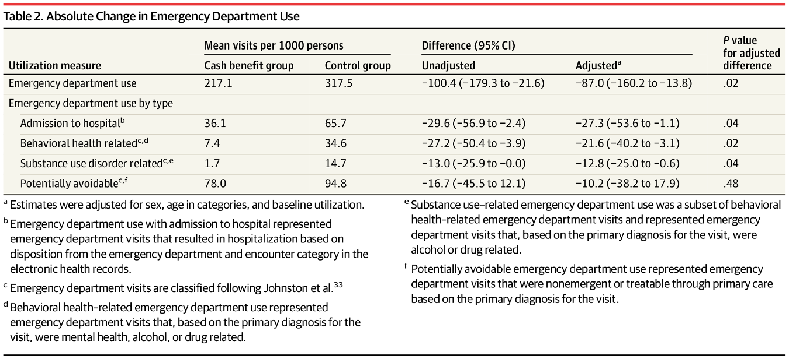
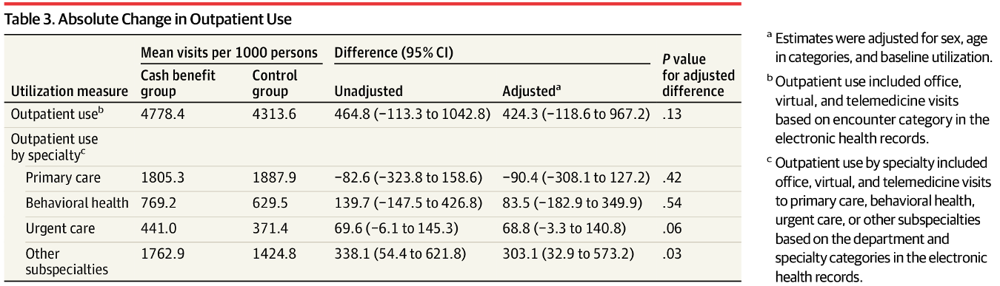

```{r, include=FALSE, results='hide'}
library(tidyverse)
library(AER)
library(fixest)
data("Fatalities", package = "AER")
```

This is a 2-hour closed book exam. Students may use a standard, non-programmable hand-held calculator. Students may use paper for working.

The exam consists of three sections (total 120 points):

1. **Section A: Multiple-Choice Questions** (36 points)
2. **Section B: Coding and Data Analysis** (52 points)
3. **Section C: Interpreting a Published Paper** (32 points)

Marks for each question in section A are as follows:

  + 3 marks awarded for a correct answer
  + 1 mark subtracted for an incorrect answer
  + 0 marks for 'E. I do not want to answer this question'

\newpage
# Section A: Multiple Choice Questions

### Question 1
You have a dataset of hospital admissions with one row per admission. The variables `hospital` and `year` identify the hospital and year of each admission. What does the following code produce?

```{r, eval=FALSE}
df %>%
  group_by(hospital, year) %>%
  summarise(total_admissions = n())
```

A) One row per hospital, showing the total number of admissions across all years
B) One row per hospital–year combination, showing the number of admissions in that hospital in that year
C) One row per admission, with two new columns added showing the hospital total admissions and year total admissions
D) The hospital with the highest number of admissions in each year
E) I do not want to answer this question

### Question 2
You have a dataset of patient records with one row per patient. The variable `age` records each patient's age in years. What does the following code produce?

```{r, eval=FALSE}
df %>%
  mutate(age_group = case_when(
    age < 18              ~ "child",
    age >= 18 & age < 65  ~ "working age",
    TRUE                  ~ "elderly"
  ))
```

A) A dataset with the same number of rows as `df`, with a new column `age_group` added: patients aged under 18 are labelled `"child"`, those aged 18 to 64 are labelled `"working age"`, and those aged 65 or over are labelled `"elderly"`
B) A dataset filtered to patients aged under 65, because `TRUE ~ "elderly"` only applies if the value of `age` is equal to `TRUE`
C) A dataset with three rows corresponding to `"child"`, `"working age"` and `"elderly"`, showing how many patients fall into each category
D) A dataset where the `age` column is replaced by the labels `"child"`, `"working age"`, or `"elderly"`
E) I do not want to answer this question

### Question 3
A researcher estimates a logistic regression of diabetes diagnosis (1 = yes, 0 = no) on `Age` (years) and `BMI`:
$$\log\!\left(\frac{\hat{p}}{1-\hat{p}}\right) = -6.0 + 0.05\,Age_i + 0.10\,BMI_i$$
where $\hat{p}$ is the predicted probability of diabetes. What is the predicted log-odds of diabetes for a patient aged 50 with BMI = 25?

A) $-6.5$
B) $-1.0$
C) $0.27$
D) $5.0$
E) I do not want to answer this question

### Question 4
Consider the same regression model as in Question 3. Four patients have the following predicted probabilities of diabetes from this model:

| Patient | $\hat{p}$ |
|---------|-----------|
| A       | 0.05      |
| B       | 0.25      |
| C       | 0.50      |
| D       | 0.90      |

For which patient is the marginal effect of a one-unit increase in BMI on the predicted probability of diabetes largest?

A) Patient A 
B) Patient B 
C) Patient C 
D) Patient D 
E) I do not want to answer this question

### Question 5
A researcher is interested in estimating the causal effect of variable X on variable Y. She believes the relationships shown in the Directed Acyclic Graph (DAG) below accurately describe the data-generating process. Which of the following is a confounder of the relationship between X and Y?

\begin{center}
\begin{tikzpicture}[
  >=Stealth,
  every node/.style={font=\small},
  node distance=1.6cm and 1.8cm
]

% Nodes
\node (Z) at (0,2) {Z};
\node (A) at (2.5,2) {A};
\node (X) at (0,0) {X};
\node (M) at (2.5,0) {M};
\node (Y) at (5,0) {Y};
\node (B) at (5,2) {B};

% Arrows
\draw[->] (Z) -- (X);
\draw[->] (Z) -- (Y);
\draw[->] (A) -- (X);
\draw[->] (A) -- (Y);
\draw[->] (X) -- (M);
\draw[->] (M) -- (Y);
\draw[->] (B) -- (Y);

\end{tikzpicture}
\end{center}
\

A) Z only
B) A only
C) M only
D) Z and A
E) I do not want to answer this question

### Question 6
Using the same DAG as in Question 5, a researcher wants to estimate the **total causal effect** of X on Y. What is the most likely consequence of including M as a covariate in the regression?

A) It removes confounding bias, providing a more accurate estimate of the total effect of X on Y
B) It blocks part of the causal pathway from X to Y, so the coefficient on X captures only the direct effect, not the total effect
C) It increases the precision of the estimate of the total effect without changing the point estimate
D) It has no effect on the coefficient of X because M is measured after X
E) I do not want to answer this question

### Question 7
A researcher estimates the following model for systolic blood pressure (mmHg) in a large population health survey:
\[
SBP_i = 100 + 6\,Male_i + 0.5\,Age_i - 0.1\,(Male_i \times Age_i) + \varepsilon_i
\]
where $Male_i = 1$ if the individual is male and 0 otherwise, and $Age_i$ is the individual's age in years. What does the coefficient $-0.1$ on the interaction term $Male_i \times Age_i$ represent?

A) The difference in mean systolic blood pressure between men and women
B) The total effect of age on systolic blood pressure
C) The difference in the age gradient of systolic blood pressure between men and women
D) The predicted systolic blood pressure for a male at age zero
E) I do not want to answer this question

### Question 8
Using the same regression model as in Question 7, what is the predicted difference in systolic blood pressure between a 40-year-old man and a 40-year-old woman?

A) 2 mmHg
B) 6 mmHg
C) -4 mmHg
D) 10 mmHg
E) I do not want to answer this question

### Question 9
A study estimates the effect of a dietary intervention on systolic blood pressure and reports a 95% confidence interval of (-8.2, -1.4) mmHg. A second study uses identical methods but recruits four times as many patients. Which of the following best describes what you would expect for the width of the confidence interval in the second study?

A) The interval would be approximately the same width, since the true effect size has not changed
B) The interval would be approximately twice as wide
C) The interval would be approximately half as wide
D) The interval would be approximately quarter as wide
E) I do not want to answer this question

### Question 10
A health authority introduces a smoking cessation programme in County A starting in 2022. County B does not receive the programme. The percentage of adults who smoke is shown below:

| County | 2021 | 2023 |
|--------|------|------|
County A | 28% | 20%
County B | 25% | 22%

Using a difference-in-differences approach, what is the estimated effect of the programme on smoking prevalence?

A) $-8$ percentage points
B) $-5$ percentage points
C) $-3$ percentage points
D) $+2$ percentage points
E) I do not want to answer this question

### Question 11
Which of the following assumptions is required for the difference-in-differences estimate in Question 10 to have a causal interpretation?

A) Smoking prevalence must be equal in County A and County B in 2021
B) The programme must reach all adults in County A
C) The two counties must have the same population size
D) In the absence of the programme, the change in smoking prevalence over time would have been the same in both counties
E) I do not want to answer this question

### Question 12
A randomised controlled trial evaluates a new cardiovascular drug. Researchers use a Cox proportional hazards model to estimate the effect of the drug on all-cause mortality, and report a hazard ratio of 0.72 (95% CI: 0.58–0.89) compared to placebo. Which of the following is the most appropriate interpretation?

A) Patients receiving the drug have a 72% lower hazard of dying than patients on placebo; the result is statistically significant at the 5% level
B) Patients receiving the drug have a 28% lower hazard of dying than patients on placebo; the result is statistically significant at the 5% level
C) The result is not statistically significant at the 5% level
D) Patients receiving the drug have a 28% higher hazard of dying than patients on placebo; the result is statistically significant at the 5% level
E) I do not want to answer this question

\newpage
# Section B: Coding and Data Analysis

A researcher has a dataset called `Fatalities`, which contains annual data from 48 US states between 1982 and 1988. She is investigating whether alcohol taxes affect motor vehicle fatalities.

Key variables include:

- `fatal`: number of motor vehicle fatalities
- `beertax`: tax on a case of beer (in real 1988 US dollars)
- `pop`: number of people living in the state
- `state`: factor indicating US state
- `year`: factor indicating year
- `drinkage`: minimum legal drinking age
- `income`: per capita personal income (in 1987 US dollars)

### Question 1: Data manipulation and summary statistics

The code below performs some data wrangling and produces summary statistics for the `Fatalities` dataset.

a. Describe what `mutate(mrall = fatal / pop * 100000)` does. Explain why the researcher might want to use `mrall` rather than `fatal` as the outcome variable for her study. **[4 marks]**

b. Describe what `mutate(log_income = log(income))` does. Explain two reasons why a researcher might prefer to include `log(income)` rather than `income` in levels. **[4 marks]**

c. The `mrall_fig` plot is  be generated by the code below. Describe what is on each axis, and explain what is shown by the `geom_point` and `geom_smooth` layers. **[6 marks]**

d. Describe what `mean_mrall` and `mean_beertax` represent in `mrall_descriptives`. What pattern do you observe between the two income groups? **[6 marks]**

```{r, message=FALSE, warning=FALSE}
Fatalities <- Fatalities %>%
  mutate(mrall = fatal / pop * 100000) %>%
  mutate(log_income = log(income))

mrall_fig <- Fatalities %>%
  ggplot(aes(x = beertax, y = mrall)) +
  geom_point() +
  geom_smooth(method = "lm", se = TRUE)

mrall_descriptives <- Fatalities %>%
  mutate(income_group = if_else(income > median(income),
                                "High income", "Low income")) %>%
  group_by(income_group) %>%
  summarise(
    mean_mrall   = mean(mrall,    na.rm = TRUE),
    mean_beertax = mean(beertax,  na.rm = TRUE)
  )
mrall_descriptives
```

### Question 2: Regression

The code below estimates two regression models using the `Fatalities` dataset.

a. Interpret the coefficient on `beertax` in `model_a`. What assumptions are necessary for this to be interpreted as the causal effect of beer tax on vehicle fatalities? **[6 marks]**

b. The coefficient on `beertax` changes when `log_income` is added in `model_b`. What does this suggest about the relationship between income, beer taxes, and vehicle fatality rates? In your answer, explain the direction of the bias in `model_a` and why it arises. **[8 marks]**

c. Suggest one further variable that `model_b` does not control for that could bias the coefficient on `beertax`. Explain the direction of the bias it would introduce and why. **[6 marks]**

d. Write the code to add state and year fixed effects to model_b using feols. **[4 marks]**

e. Explain why a researcher would want to include state and year fixed effects, giving a concrete example of the type of confounding each one addresses. **[8 marks]**

```{r, message=FALSE, warning=FALSE}
model_a <- feols(mrall ~ beertax, data = Fatalities)
model_a
```

```{r, message=FALSE, warning=FALSE}
model_b <- feols(mrall ~ beertax + log_income, data = Fatalities)
model_b
```

\newpage
# Section C: Interpreting a Published Paper

In this part of the exam, you will interpret results from a study investigating the effect of a cash benefit on use of health care. During the COVID-19 pandemic, the City of Chelsea, Massachusetts, invited low-income households to apply for a lottery for cash benefits. Eligible households were randomized either to a treatment group or control group. The treatment group received \$400 per month per household in unconditional cash benefits for 10 months and the control group received no cash benefit. The authors evaluate the program's impact on health care utilization using administrative health records from two major hospital systems. The two figures below are taken from the paper.

The study estimates the following regression model:
\begin{equation}
    Y_{i} = \beta_0 + \beta_1 CASH_{i} + \beta_2 X_{i} + \varepsilon_{i},
\end{equation}
where \( Y_{i} \) is the utilization outcome of individual \( i \), \( CASH_{i} \) is a dummy variable equal to 1 if an individual won the lottery and was thus randomized into the treatment group, and \( X_{i} \) is a vector of controls for age group, sex, and baseline health care utilization.

1. The authors include controls for age group, sex, and baseline health care utilization in their regression.

    a) Is including control variables necessary to obtain an unbiased estimate of the treatment effect in this randomised controlled trial? Why or why not? **[4 marks]**

    b) What is the main benefit of controlling for age group, sex and baseline health care utilization in this regression? **[4 marks]**

2. Look at the two figures below. What is the effect of being randomized to the cash transfer on number of emergency department visits and number of outpatient visits per 1,000 people? Comment on the sign, magnitude and statistical significance of the effects. **[8 marks]**

3. Propose two mechanisms that could explain the pattern of results you described in Question 2. **[8 marks]**

4. This study was conducted in a single city in the US during the COVID-19 pandemic.

    a) Identify two reasons why the results of this study might not generalise to other settings or populations. **[4 marks]**

    b) If you wanted to assess whether the findings are externally valid, what kind of additional evidence or analysis would be helpful? **[4 marks]**

{width=100%}

{width=100%}

\newpage
\center
END OF EXAM
