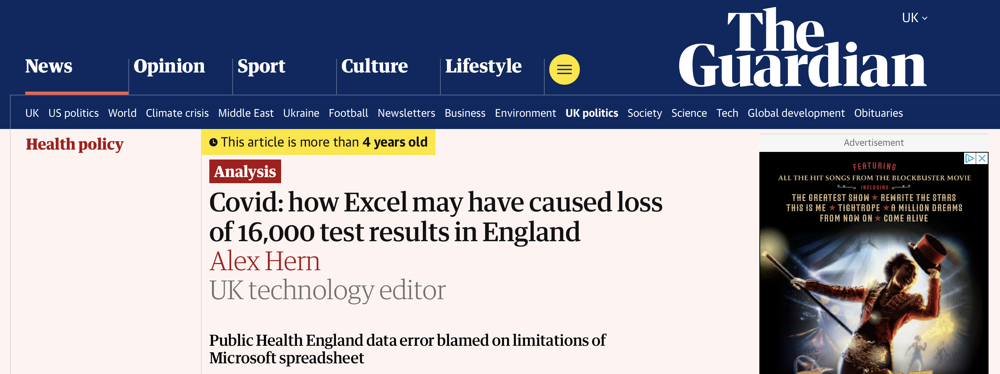
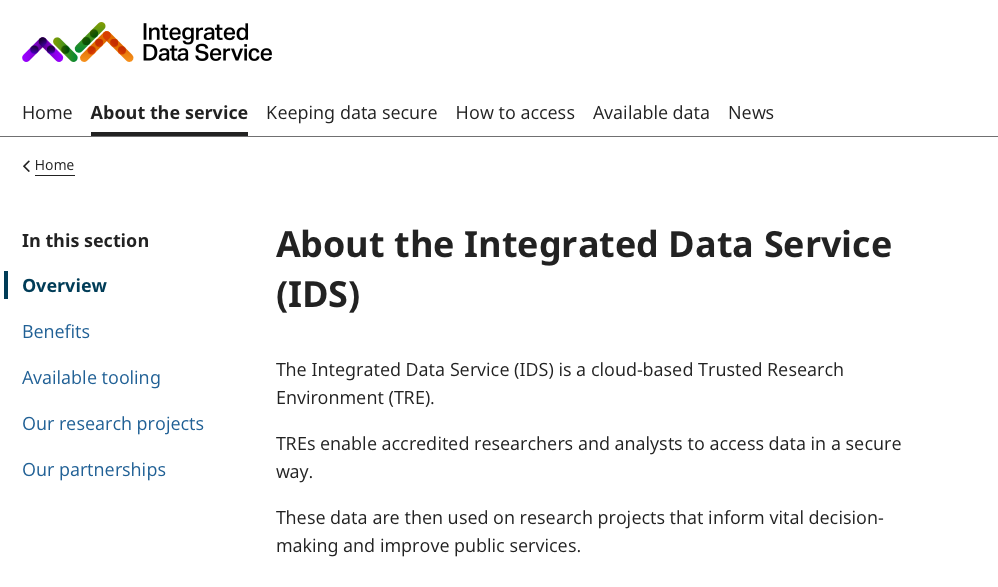
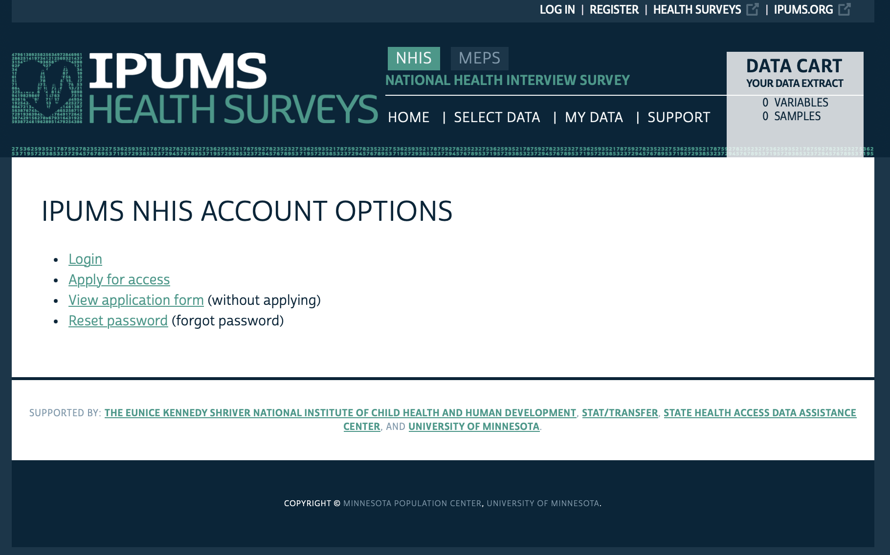
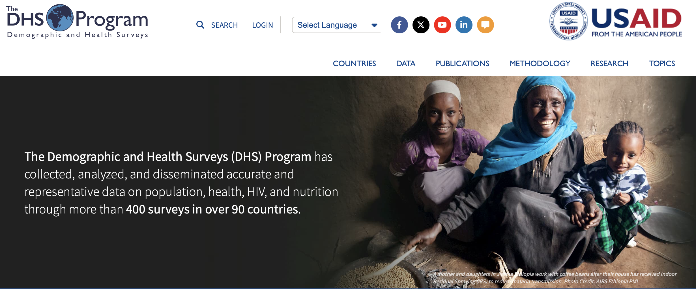
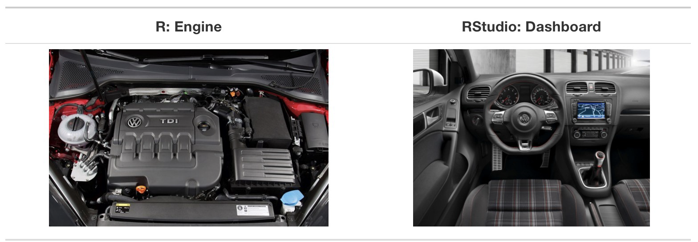
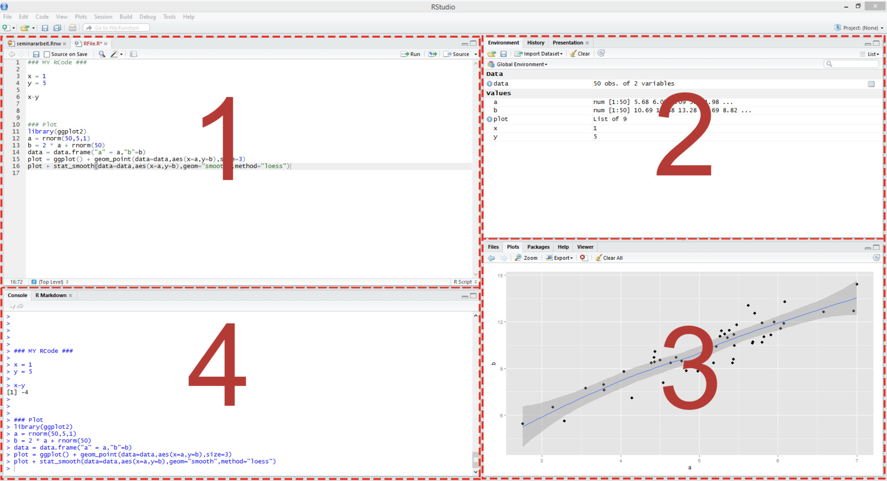
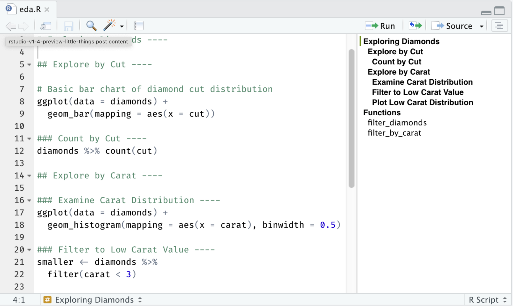
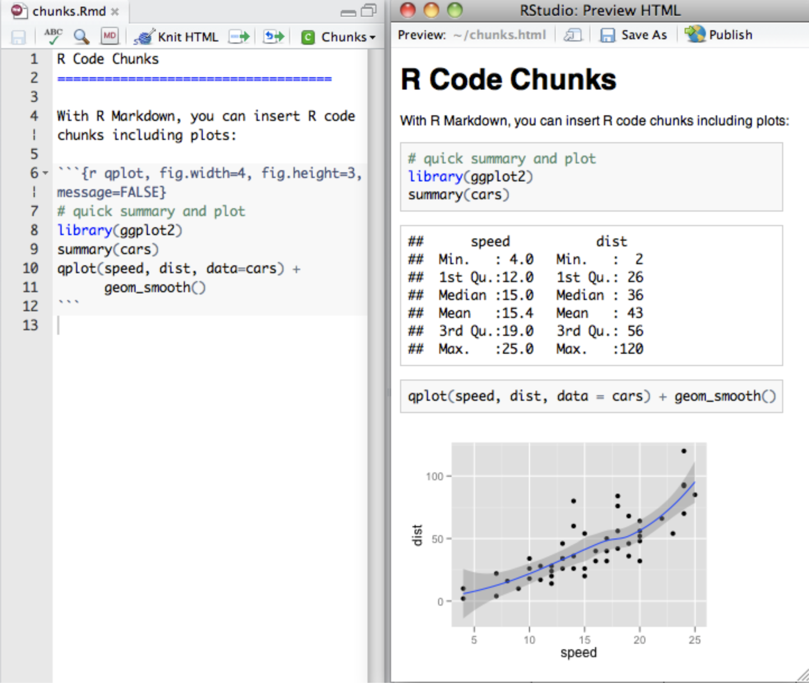

```{r setup, include=FALSE}
library(tidyverse)
library(ggthemes)

theme_metro <- function() {
  theme_classic() +
  theme(
    panel.background = element_rect(fill = "#FAFAFA", colour = "#FAFAFA"),
    plot.background = element_rect(fill = "#FAFAFA", colour = "#FAFAFA"),
    text = element_text(size = 16),
    axis.title.x = element_text(hjust = 1),
    axis.title.y = element_text(hjust = 1, angle = 0)
  )
}

set.seed(123)
```

# Welcome

## What is health analytics?

:::: {.columns}
::: {.column width="60%"}
- The use of data and statistical reasoning to support decisions about health and healthcare
- It involves:
  - Analyzing patterns and relationships in health data using statistical methods
  - Evaluating evidence to distinguish correlation from causation
  - Communicating results to managers, policy-makers, clinicians and the public
- Health analytics is **applied**: the goal is not just to estimate models but to inform real-world decisions under uncertainty
:::

::: {.column width="40%"}
{width="100%"}
:::
::::

## Why learn health analytics? 

*Uses of health analytics during COVID-19*

:::: {.columns}
::: {.column width="60%"}
- **Tracking and monitoring** health trends: contact tracing, identifying hotspots and vulnerable groups
- **Evaluating effectiveness** of treatments: clinical trials and routinely collected data used to identify treatments such as dexamethasone
- **Optimizing resource allocation**: distribution of PPE, vaccine roll-out, predicting ICU strain
- **Policy decision support**: health and economic data combined to evaluate costs and benefits of lockdown policies
:::

::: {.column width="40%"}
{width="100%"}
:::
::::

## A Cautionary Tale

:::: {.columns}
::: {.column width="40%"}
- 15,841 COVID-19 cases were not reported to the "test-and-trace system" used to notify contacts
- **Cause:** System was using MS Excel to store data and reached the maximum row limit 
- **Impact:** Over 50,000 potential contacts of infected individuals were not notified to self-isolate.
:::

::: {.column width="60%"}
{width="100%"}
:::
::::

## Course road map

| Lecture | Topic |
| --- | --- |
| [**1**]{style="color: #C8102E"} | [**Introduction to health data & R**]{style="color: #C8102E"} |
| 2 | Data visualization |
| 3 | Data wrangling & exploratory data analysis |
| 4 | Causal inference |
| 5 | Linear regression |
| 6 | Linear regression: uncertainty & hypothesis testing |
| 7 | Panel data: difference-in-differences & fixed effects |
| 8 | Limited dependent variables: LPM, logit, probit |
| 9 | Introduction to machine learning for health analytics |
| 10 | Course review |

## The health analytics pipeline

::: {.centered-fig .nonincremental}
{width="80%"}
:::

## Today

- **Overview of course**
  - Learning outcomes
  - Road map
  - Resources!
- **Health data**
  - Understand key types of health data and their sources
  - Know how to look for and access health data!
- **Introduction to R + RStudio**
  - Setting up and navigating RStudio
  - Projects in R
  - R scripts and R markdown files
  - Installing and using packages
  - Looking at data and basic plotting

## Course objectives

:::: {.columns}
::: {.column width="60%"}
- **Learn to code** and get your hands dirty working with data!
- **Equip you** with data analysis and statistics tools used in health analytics
- **Enable you** to read and critically appraise research and policy reports
- **Learn to learn**: tools and techniques are changing fast and you need to be able to stay up-to-date!
:::

::: {.column width="40%"}
{width="100%"}
:::
::::

## What makes a good health analyst?


- **Technical skills:**
  - Maths and statistics?
  - Programming?
- These are important, but an essential and overlooked skill is being an **imaginative and critical storyteller**
- This will help you to:
  - Have a clear idea of the story you want to explore
  - Understand how the world works (or might work)
- **This does not mean 'p-hacking'** or torturing the data until you see the results you want!


## How to do well in this course

- **Show up and ask questions:**
  - **Lectures:**
    - Hour 1: introduce 'big-picture' concepts and material
    - Hour 2: in-class exercise
  - **Tutorials:** more hands-on practice of coding and working with data
  - **Other resources:** online discussion forum, office hours, textbooks, [DataCamp](https://www.datacamp.com) for extra support on coding, R, GitHub and statistics (the "Introduction to the Tidyverse" course is particularly useful)
- **Work together:** real world works in teams
- **Experiment:** you will learn this material by doing it
  - Code, code, code!
  - Find data you want to work with and play

## Artificial intelligence

:::: {.columns}
::: {.column width="60%"}
- With great power, comes great responsibility
- You are actively encouraged to use AI to help you with coding and understanding statistical concepts
- **Examples:** ChatGPT, Claude, JuliusAI, Github Copilot
- **Ground rules:**
  - **Check data use rules**: do NOT upload microdata unless you are SURE this is allowed
  - **Use your brain**: these tools are complements not substitutes to understanding the material
  - **Show your working**: tell me what tool you used and give me the prompts
  - **Share your insights**: we are all learning this together. What worked?
  - **Beware of incorrect outputs**
:::

::: {.column width="40%"}
{width="100%"}
:::
::::

# Health Data

## Types of Health Data

- **Clinical Trials**: controlled experiments designed to test interventions
  - Characteristics: strict protocols, high internal validity
  - "Gold standard": Randomized controlled trials (RCTs)
- **Surveys**: data collected through questionnaires or interviews
  - Characteristics: captures self-reported outcomes, demographics, behaviors
  - Examples: National Health and Nutrition Examination Survey (NHANES)
- **Administrative Data**: data generated during the day-to-day running of health care organizations
  - Electronic Health Records (EHRs): patient histories, diagnoses, test results
  - Claims Data: billing information from insurers

## Types of Health Data: Pros & Cons

|  | Pros | Cons |
| --- | --- | --- |
| Clinical trials | Able to control conditions, high internal validity | Expensive, slow |
| Surveys | Easy to access, often lots of detail | Low response rate, self-report bias (e.g. underreporting smoking), small samples |
| Administrative data | Large-scale, whole population | Hard to access, hard to work with, not designed for research |

## Hunting for health data


- **Start with public/open sources**
- **Government agencies**
  - US: [data.gov](https://data.gov)
  - UK: [data.gov.uk](https://www.data.gov.uk)
- **Academic projects**
  - IPUMS, CPC: compile and harmonize data across countries and time periods
  - ICSPR: data for published papers often deposited here
- **Other public repositories**
  - Kaggle for data science competitions


## Top tips for finding data

- Identify variables most crucial to your research question
- Start with government agencies
- Check data availability for published studies
- Be creative: APIs, web scraping, combining data from multiple sources
- **Always follow terms of use!** There are often restrictions on commercial use and sharing with others

## Interacting with health data

:::: {.columns}
::: {.column width="60%"}
- **Download flat files & run analysis on own machine**
  - Common data types: CSV, Excel, JSON, XML, txt
  - Advantage is complete control of analysis
- **APIs**
  - Use code to query data and pull extract
  - Lots of support for doing this with Python or R!
- **Access to secure server**
  - Run all analysis on external server
  - May be restrictions on pulling outputs off server
  - May have to pay for computing power used
:::

::: {.column width="40%"}
{width="100%"}
:::
::::

## Open data example: IPUMS

:::: {.columns}
::: {.column width="60%"}
- **Integrated Public Use Microdata Series**
- A collection of standardized and harmonized datasets aimed at facilitating research in social sciences and public health
- **Includes:**
  - **Demographic and Health Surveys:** health and well-being survey for 42 African countries and 9 Asian countries focusing on infant and child health
  - **Health:** US National Health Interview Survey and Medical Expenditure Panel Survey
  - **International:** census data from 104 countries (>1 billion person records)
  - **Terra:** environmental data
- Register for a free account at [ipums.org](https://www.ipums.org) to access the data
:::

::: {.column width="40%"}
{width="100%"}
:::
::::

## Open data example: Demographic and Health Surveys

:::: {.columns}
::: {.column width="60%"}
- **Survey data**: health and well-being survey focusing on child and maternal health
- Includes 400 surveys in over 90 countries
- Variables include:
  - Height and weight of kids
  - Mortality
  - Some biomarkers from blood tests e.g. HIV, malaria, lead exposure
  - Household characteristics (housing quality, assets)
- Download flat files and run analysis on own machine
:::

::: {.column width="40%"}
{width="100%"}
:::
::::

## Open data example: Nightingale

- Imaging and machine learning
- Huge new imaging datasets: ECGs, X-rays, microscopy
- Run Python on Nightingale servers

# Introduction to R

## First: a warning!

- This practical introduces many features of R very quickly
- **Do not worry if everything does not make sense immediately**
- The goal today is to:
  - Become comfortable running R code
  - Be able to navigate around RStudio
  - Learn how to view data!
- We will return to these ideas repeatedly during the course
  - Learning to look up help is part of the skill!
- **There are many different ways to do most tasks in R.** I will show you 1-2 ways, but you are welcome to explore others

## R and RStudio

- **What is R?**
  - A powerful programming language for statistical computing and data analysis
  - Open-source and widely used in academia and industry
- **Why R?**
  - Open source
  - User-friendly for beginners to coding and programming
  - Designed for statistical computing and data analysis
  - Huge codebase for health analytics
- **What is RStudio?**
  - An interface for interacting with R (jargon is "integrated development environment")
  - Provides tools for writing, running, and visualizing R code

## A note on programming languages: R vs Python 


- **Why we are using R in this course**
  - Widely used in applied health research
  - Clear, readable syntax for learning core analytical concepts
  - Designed for statistics and data analysis
- **The main alternative: Python**
  - General-purpose language with a strong data-science ecosystem
  - Particularly strong for machine learning, engineering, and production systems
  - Widely used outside academia and in industry settings
- **Moving between R and Python**
  - Shared data formats and interoperable workflows mean skills transfer directly
  - Gen AI tools make translation and debugging easier


## R and RStudio

:::: {.columns}
::: {.column width="60%"}
- **R is like a car's engine. RStudio is like a car's dashboard.**
- R is a programming language that runs computations
- RStudio provides an interface by adding many convenient features and tools
- Just as having access to a speedometer, rear view mirrors, and a navigation system makes driving much easier, using RStudio's interface makes using R much easier as well
:::

::: {.column width="40%"}
{width="100%"}
:::
::::

## Getting started in RStudio

:::: {.columns}
::: {.column width="50%"}
- See what data and other objects you have here (top-right)
- Open and write your code here (top-left)
- "Command console": see code running and error messages (bottom-left)
- Other panes e.g. figures, file directory (bottom-right)
:::

::: {.column width="50%"}
{width="100%"}
:::
::::

## In-class exercise: install R and RStudio

- **Download and install R on your computer**
  - Go to: [cran.rstudio.com](https://cran.rstudio.com)
  - Download the latest full version (i.e., not beta) for your machine
- **Download and install RStudio on your computer**
  - Go to: [posit.co/download/rstudio-desktop](https://posit.co/download/rstudio-desktop/)
  - Download the latest full version that works with your machine
- **Open RStudio**

## R projects

- An R project is a self-contained working environment that defines the home of your work
- Sets the working directory automatically to that folder
- Keeps scripts, data & outputs organized
- Makes your work reproducible and portable
- In the next exercise you will create an R project for this course!
  - Save all the scripts and data into the project folder

## In-class exercise: create an R project

1. Go to **File > New Project**
2. Select **New Directory**
3. Under "Project Type", select "New Project"
4. Under "Create New Project", type in a name under "Directory name" and select "Create project"

## In-class exercise: configure RStudio settings

- Go to **Tools > Global options**
- Change the "Save workspace to .RData on exit" to **Never**
- Uncheck the "Restore .RData into workspace at start"
- **Why?**
  - By default, R saves all your objects to `.RData` on exit
  - On restart, it reloads these objects automatically
  - This can cause confusion — especially when you share code with classmates who don't have the same `.RData` file

## R scripts

:::: {.columns}
::: {.column width="50%"}
- An R script is a plain text file that stores a sequence of R commands
- Scripts let you:
  - Save your work
  - Rerun analysis
  - Share code with others!
:::

::: {.column width="50%"}
{width="100%"}
:::
::::

## R Markdown

- An R Markdown file combines:
  - Plain text
  - R code
  - Output (tables, figures, results)
- You write in plain text with formatting cues
- Pandoc uses these cues to turn your document into attractive output
- You can open a new `.Rmd` file in the RStudio IDE by going to **File > New File > R Markdown...**
- Each lecture and tutorial will have an in-class exercise in R Markdown

## R Markdown

:::: {.columns}
::: {.column width="50%"}
- You can include chunks of code in your file
- You can run the whole file or individual chunks
- When you "knit" the file, you will see the text, code and output altogether
:::

::: {.column width="50%"}
{width="100%"}
:::
::::

## In-class exercise: download the exercise file

1. Download the R Markdown exercise file for Lecture 01
2. Save it in the folder for this course
3. Open the Rmd file from within R

Work through the exercise which covers:

- The R and RStudio workflow
- How to run code
- Using R as a calculator
- Variables, functions, vectors
- Data frames
- Viewing data
- Preview: making graphs in R

## R Packages

:::: {.columns}
::: {.column width="60%"}
- R "packages" are tools that aren't built into the language but were created later by other programmers
- Before you can use a package, you need to:
  1. **Install** it using `install.packages()` (once per computer!)
  2. **Load** it using `library()` (once per session!)
- **Packages you will need to load for almost every session:**
  - `tidyverse`: suite of tools for wrangling and visualizing data
:::

::: {.column width="40%"}
{width="100%"}
:::
::::

## Vectors

- A vector holds the same type of data in an array
- It can contain a collection of numbers, arithmetic expressions, logical values or character strings
- A vector can be created using an in-built function in R called `c()`
- Elements must be comma-separated
- All elements in a vector can be processed all at once

::: {.fragment}
```{r}
codes <- c(380, 124, 818)
codes

country <- c("Italy", "Canada", "Egypt")
country
```
:::

## What's wrong with these codes?

::: {.fragment}
**Incorrect:**

```{r, eval=FALSE}
country <- c(Italy, Canada, Egypt)
```

**Correct:**

```{r, eval=FALSE}
country <- c("Italy", "Canada", "Egypt")
```

- Character values need to be in quotation marks!
:::

## Vectors: shortcuts

- To create a vector of integers from 1 to 10, use the shortcut:

::: {.fragment}
```{r}
c(1:10)
```
:::

**Challenge questions**

- How can we create a vector of integers from 1 to 5 AND 7, 9?

::: {.fragment}
```{r}
c(1:5, 7, 9)
```
:::

- Can you create a vector of odd numbers from 1 to 9?

::: {.fragment}
```{r}
c(1:5) * 2 - 1
```
:::

## Data frames

- A data frame stores data tables
- It is a list of vectors of equal length

::: {.fragment}
| participant | age | height |
| --- | --- | --- |
| Dave | 30 | 179 |
| Sally | 28 | 166 |
:::

::: {.fragment}
```{r}
n <- c(2, 3, 5)
s <- c("aa", "bb", "cc")
b <- c(TRUE, FALSE, TRUE)
df <- data.frame(n, s, b)
df
```
:::

## Indexing

- To access an element of a vector or a data frame, use square brackets `[...]`
- Indicate the location of the element inside the brackets

::: {.fragment}
```{r}
codes <- c(380, 124, 818)
codes[2]

df <- data.frame(n = c(2, 3, 5),
                 s = c("aa", "bb", "cc"),
                 b = c(TRUE, FALSE, TRUE))
df[2, 2]
```
:::

## Indexing continued

- How could we retrieve the 2nd column of `df`?

::: {.fragment}
```{r}
df[, 2]
```
:::

- How could we retrieve the 2nd row of `df`?

::: {.fragment}
```{r}
df[2, ]
```
:::

## Takeaways: what you need to understand

:::: {.columns}
::: {.column width="60%"}
- **Overview of course**
  - Learn data analysis and statistics tools used in health analytics
  - Learn to learn!
- **Health data**
  - Understand pros and cons of survey, trials and admin data
  - Understand how to find health data and get stuck in!
- **Introduction to R + RStudio**
  - Navigate around RStudio and run code
  - Understand how to view data
:::

::: {.column width="40%"}
{width="100%"}
:::
::::

## This week

- Troubleshoot any remaining issues with R and RStudio
- If you are new to R, work through the coding tutorials
- Sign up for the discussion forum. Post something!
- Register for access to IPUMS if needed. Check course materials for links.


