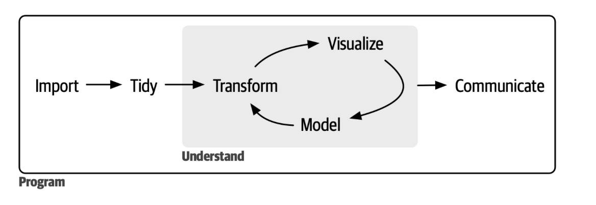
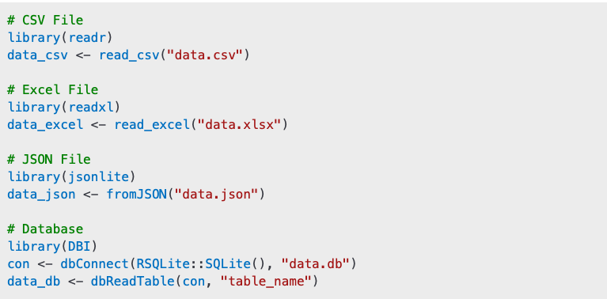
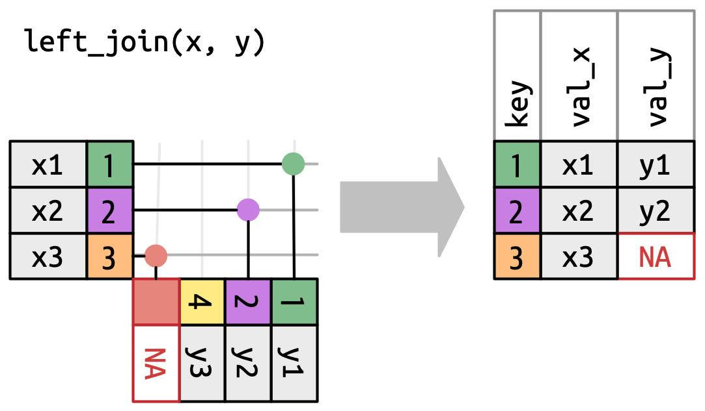
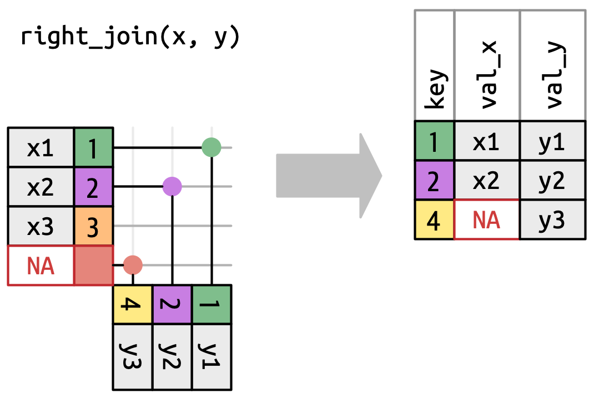
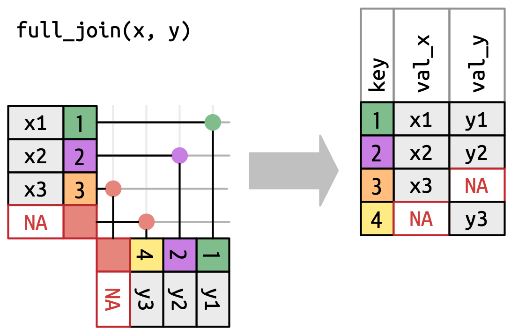
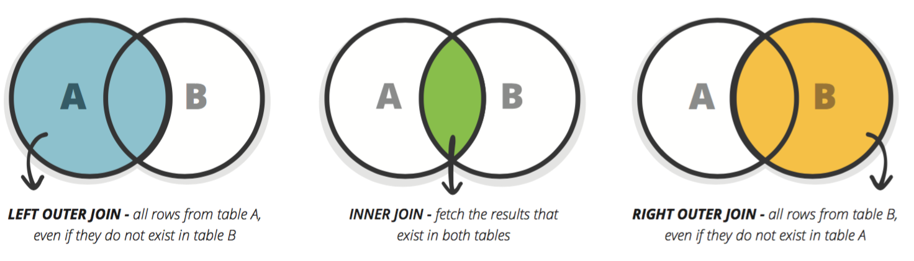
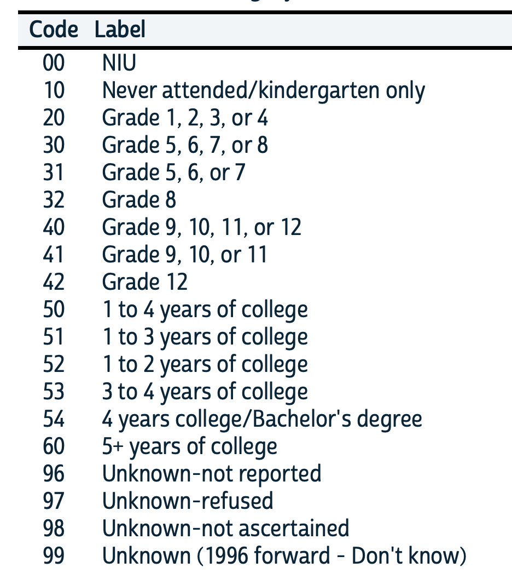
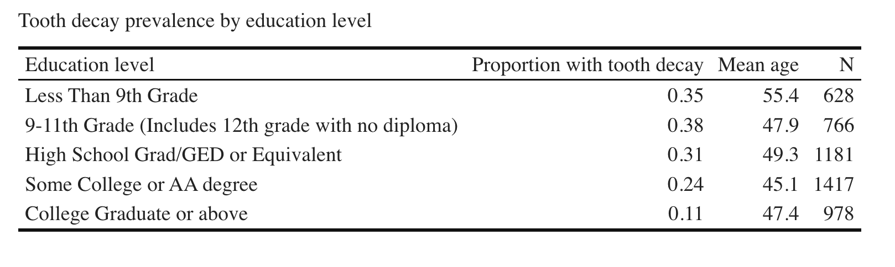

```{r setup, include=FALSE}
library(tidyverse)
library(kableExtra)

theme_metro <- function() {
  theme_classic() +
  theme(
    panel.background = element_rect(fill = "#FAFAFA", colour = "#FAFAFA"),
    plot.background = element_rect(fill = "#FAFAFA", colour = "#FAFAFA"),
    text = element_text(size = 16),
    axis.title.x = element_text(hjust = 1),
    axis.title.y = element_text(hjust = 1, angle = 0)
  )
}
```

## Course road map

| Lecture | Topic |
| --- | --- |
| 1 | Introduction to health data & R |
| 2 | Data visualization |
| [**3**]{style="color: #C8102E"} | [**Data wrangling & exploratory data analysis**]{style="color: #C8102E"} |
| 4 | Causal inference |
| 5 | Linear regression |
| 6 | Linear regression: uncertainty & hypothesis testing |
| 7 | Panel data: difference-in-differences & fixed effects |
| 8 | Limited dependent variables: LPM, logit, probit |
| 9 | Introduction to machine learning for health analytics |
| 10 | Course review |

## The health analytics pipeline

::: {.centered-fig .nonincremental}
{width="80%"}
:::


## Today

- **Importing data**
- **Merging datasets**
- **Descriptive statistics:** grouping and summarizing data
- **Exploratory data analysis**
- **Survey data:** handling missing values and survey weights
- **Making tables**

## Importing data in R

:::: {.columns}
::: {.column width="60%"}
- **Importing data** is usually the first step in any analysis
- Different data formats require different packages
- Most functions return a data frame
- The same downstream tools (filter, mutate) etc work regardless of initial format
- These import functions:
  - Read values into R
  - Assign data types (numeric, character, factor, date etc)
  - Recognise common missing value codes automatically and code them as NA
:::

::: {.column width="40%"}
{width="100%"}
:::
::::

# Merging Datasets

## Merging dataframes

- To answer many real world questions, you often need to combine information from multiple datasets
- To join two data frames you need:
  - Two data frames containing related information
  - A key variable that appears in both data frames used to match rows across datasets
  - A join function that tells R how to combine the data

## Joins example

- How do we combine information from two tables?

::: {.fragment}
```{r}
dogs <- data.frame(
  dog_id = 1:4,
  dog_name = c("Rover", "Fido", "Daisy", "Buddy"),
  breed = c("Great Dane", "Dalmatian", "Mutt", "Poodle")
)

owners <- data.frame(
  owner_id = 1:4,
  owner_name = c("Alex", "Brenda", "Charlie", "Diana"),
  dog_name = c("Buddy", "Artemis", "Fido", "Roger")
)

dogs
owners
```
:::

::: {.notes}
What is the key variable? A key does not have to be numeric! But often it is easy to have a numeric key. Especially for large datasets, can make join quicker.
:::

## Left join

:::: {.columns}
::: {.column width="60%"}
- `left_join(x,y)` keeps all observations in x, and matches as many rows in y as possible
- Every row of x is preserved in the output
- If there is no matching row in y, then it artificially creates an NA row in y to match with and puts it in the end
:::

::: {.column width="40%"}
{width="100%"}
:::
::::

::: {.fragment}
```{r}
owners %>% left_join(dogs, by = "dog_name")
```
:::

## Right join

:::: {.columns}
::: {.column width="60%"}
- `right_join(x,y)` keeps all observations in y and matches as many rows in x as possible
- Every row of y is preserved in the output
- If there is no matching row in x, then it artificially creates an NA row in x to match with and puts it in the end
:::

::: {.column width="40%"}
{width="100%"}
:::
::::

::: {.fragment}
```{r}
owners %>% right_join(dogs, by = "dog_name")
```
:::

## Inner join

:::: {.columns}
::: {.column width="60%"}
- `inner_join(x,y)` retains rows if and only if the keys are equal
:::

::: {.column width="40%"}
{width="100%"}
:::
::::

::: {.fragment}
```{r}
owners %>% inner_join(dogs, by = "dog_name")
```
:::

## Full join

:::: {.columns}
::: {.column width="60%"}
- `full_join(x,y)` keeps all observations that appear in x or y
- Every row of x and y is included in the output because both x and y have a fall back row of NAs
- The output starts with all rows from x, followed by the remaining unmatched y rows
:::

::: {.column width="40%"}
{width="100%"}
:::
::::

::: {.fragment}
```{r}
owners %>% full_join(dogs, by = "dog_name")
```
:::

## Join types summary

::: {.centered-fig .nonincremental}
{width="80%"}
:::

## Key considerations for merging

- **Join does not require 1:1 matching**
- If one owner matches multiple dogs, the owner's row will be repeated once for each match
- `left_join()` is the one you will use most often: allows you to add new variables onto your analysis dataframe

## When do joins increase the row count?

::: {.fragment}
```{r}
# When one owner has multiple dogs
owners_v2 <- data.frame(
  owner_id = 1:2,
  owner_name = c("Alex", "Brenda")
)

dogs_v2 <- data.frame(
  dog_id = 1:4,
  owner_id = c(1, 1, 1, 2),
  dog_name = c("Rover", "Fido", "Daisy", "Buddy"),
  breed = c("Great Dane", "Dalmatian", "Mutt", "Poodle")
)

owners_v2 %>% left_join(dogs_v2, by = "owner_id")
```
:::

## Appending datasets with bind_rows()

- `bind_rows()` appends dataframes row-wise
- Requires the same column names
- Missing columns are filled with NAs
- Mental model: "put these datasets underneath each other"

::: {.fragment}
```{r}
df1 <- data.frame(x = 1:3, y = c("a", "b", "c"))
df2 <- data.frame(x = 4:5, y = c("d", "e"))

df1 %>% bind_rows(df2)
```
:::

# Descriptive Statistics: Grouping and Summarizing Data

## Functions we've covered so far

- **`filter()`** - select rows based on conditions
- **`select()`** - choose columns
- **`mutate()`** - create new variables
- **`arrange()`** - sort rows

## Converting between different variable types

- Find out how your variable is stored using `class(df$varname)`
- Variable types:
  - **Numeric:** for calculations
  - **Factor:** categorical variable with levels
  - **Character:** text strings
  - **Date:** temporal data
  - **Logical:** TRUE/FALSE
- Different classes behave very differently in models and plots — the same variable (e.g. year) may be treated as:
  - **Numeric** → trends, slopes, extrapolation
  - **Factor** → group comparisons, year fixed effects
- R stores factor variables as a set of labels stuck onto numbered boxes

## Converting between variable types in R

- Convert year variable stored as numeric to factor:

::: {.fragment}
```{r, eval=FALSE}
df <- df %>% mutate(year_f = as.factor(year))
```
:::

- Convert year variable stored as factor to numeric:

::: {.fragment}
```{r, eval=FALSE}
df <- df %>% mutate(year = as.numeric(as.character(year_f)))
```
:::

- `as.character` converts to a string containing the labels, which can then be converted to a factor

## case_when()

- `case_when` applies a series of if-else rules from top to bottom
- Useful for defining categorical variables based on existing variables
- `between` checks whether a numeric value lies between two values

::: {.fragment}
```{r, eval=FALSE}
df <- df %>%
  mutate(
    age_group = case_when(
      between(age, 0, 17)  ~ "Child",
      between(age, 18, 39) ~ "Young adult",
      between(age, 40, 64) ~ "Middle-aged",
      age >= 65            ~ "Older adult",
      TRUE                 ~ NA_character_
    )
  )
```
:::

## summarise()

- `summarise()` reduces a dataset to one or more summary values
- Each summary is computed over all rows in the data
- Common summaries include: mean, standard deviation, sum, count
- Can compute many summary stats at the same time
- If applied to the whole dataframe without grouping, will return a one-row dataset containing the summary stats
- Many summary functions return NA if any values are missing. Use `na.rm=TRUE` if you don't want this

::: {.fragment}
```{r, eval=FALSE}
df %>%
  summarise(
    mean_var1 = mean(var1, na.rm = TRUE),
    n = n()
  )
```
:::

## group_by()

- `group_by()` allows you to group a data frame by one or more categorical variable
- It does not change the data but changes how later functions behave: "From now on, do things separately for each group"
- Commonly used before `summarise()` to produce summary statistics by group
- Suppose `var2` is a categorical variable that takes three distinct values — what will this code produce?

::: {.fragment}
```{r, eval=FALSE}
df %>%
  group_by(var2) %>%
  summarise(
    mean_var1 = mean(var1, na.rm = TRUE),
    n = n()
  )
```
:::

## ungroup()

- Good practice to add `ungroup()` after grouping so you retrieve the original data frame
- Stops you accidentally applying future operations to grouped data
- Can also add `groups = "drop"` inside `summarise`

::: {.fragment}
```{r, eval=FALSE}
df %>%
  group_by(var2) %>%
  summarise(
    mean_var1 = mean(var1, na.rm = TRUE),
    n = n()
  ) %>%
  ungroup()
```
:::

## Check your understanding

- Suppose we have the following data frame:

::: {.fragment}
```{r}
df <- data.frame(
     x = 1:5,
     y = c("a", "b", "a", "a", "b"),
     z = c("K", "K", "L", "L", "K")
)

df
```
:::

- What would the following code do? (Don't run the code! Think about what the output may look like)

::: {.fragment}
```{r, eval=FALSE}
df %>% group_by(y)
```
:::

::: {.notes}
```
# A tibble: 5 × 3
# Groups:   y [2]
      x y     z
  <int> <chr> <chr>
1     1 a     K
2     2 b     K
3     3 a     L
4     4 a     L
5     5 b     K
```
:::

## Check your understanding

- What would the following code do?

::: {.fragment}
```{r, eval=FALSE}
df %>% arrange(y)
```
:::

## Check your understanding

- What would the following code do?

::: {.fragment}
```{r, eval=FALSE}
df %>%
  group_by(y) %>%
  summarize(mean_x = mean(x))
```
:::

::: {.notes}
```
# A tibble: 2 × 2
  y     mean_x
  <chr>  <dbl>
1 a       2.67
2 b       3.5
```
:::

## Check your understanding

- What would the following code do?

::: {.fragment}
```{r, eval=FALSE}
df %>%
  group_by(y, z) %>%
  summarize(mean_x = mean(x))
```
:::

::: {.notes}
```
# A tibble: 3 × 3
# Groups:   y [2]
  y     z     mean_x
  <chr> <chr>  <dbl>
1 a     K        1
2 a     L        3.5
3 b     K        3.5
```
:::

## Check your understanding

- What would the following code do?

::: {.fragment}
```{r, eval=FALSE}
df %>%
  group_by(y, z) %>%
  mutate(mean_x = mean(x))
```
:::

::: {.notes}
```
# A tibble: 5 × 4
# Groups:   y, z [3]
      x y     z     mean_x
  <int> <chr> <chr>  <dbl>
1     1 a     K        1
2     2 b     K        3.5
3     3 a     L        3.5
4     4 a     L        3.5
5     5 b     K        3.5
```
:::

# Exploratory Data Analysis

## What is EDA?

- Exploratory Data Analysis (EDA) is the process of interrogating data in a systematic way to understand what it contains and how it was generated
- It typically includes:
  - Examining distributions (levels, spread, outliers)
  - Comparing groups and subpopulations to look for heterogeneity
  - Visualising relationships between key variables
  - Investigating missing data patterns
- **It is iterative:** findings from one step shape the next question

## Why Exploratory Data Analysis matters

:::: {.columns}
::: {.column width="60%"}
- EDA sits between data wrangling and modelling in the analytics pipeline:
  - **Wrangling:** get the data into usable form
  - **EDA:** understand what you actually have
  - **Modelling:** answer a specific question under assumptions
- EDA helps you:
  - Detect data errors, coding problems and inconsistencies
  - Understand sample selection and missingness
  - Identify relevant variation, correlation between variables and heterogeneity
  - Decide which analyses are credible and which are not
- **If you do not understand your data, no model can save you!**

:::
::::

# Survey data

## Survey weights

- Adjustments applied to survey data to ensure that results represent the target population
- **Reasons for using survey weights:**
  - **Unequal Sampling Probabilities:** Some groups are intentionally oversampled (e.g., racial minorities, elderly, rural residence) to ensure sufficient sample size
  - **Nonresponse:** To account for differences between those who responded and those who didn't
  - **Post-stratification adjustment:** Aligns survey data with known population distributions (e.g., age, gender)
- **Core idea:** each observation in the sample represents itself plus others in the population
  - "Analysis weights" are scaled to sum to the sample size
  - "Population weights" are scaled to sum to the population size

## Using survey weights in R

- **Core R packages:**
  - `survey` and `srvyr` packages
  - `srvyr` integrates well with tidyverse for a user-friendly workflow
- **Key Steps:**
  1. Load libraries!
  2. Load survey data
  3. Define the survey design using weights
  4. Use design for analysis
  5. READ the manual
- IPUMS has detailed description of weights for each data series and code snippets explaining how to work with them

## Survey weights: Important caveat

- You can calculate many summary statistics by applying weights manually (e.g. `weighted.mean()`)
- However, standard errors can get very complicated so it's usually better to work with the designed survey approach
- **CAUTION:** must make sure you use the functions designed for survey analysis
  - `survey_mean()` not `mean()`
  - `survey_total()` not `n()`
- Most regular functions will not throw an error!

## Survey weights example

::: {.fragment}

```{r survey-example, eval=TRUE}
# Install if needed: install.packages(c("survey", "srvyr"))
library(survey)
library(srvyr)

# Create example survey data
set.seed(123)
survey_data <- tibble(
  id = 1:100,
  outcome = rnorm(100, mean = 50, sd = 10),
  weight = rnorm(100, mean = 1, sd = 0.2),
  stratum = rep(c("A", "B"), 50)
)

# Design survey with weights
survey_design <- survey_data %>%
  as_survey_design(ids = id, weights = weight, strata = stratum)

# Calculate weighted mean and confidence interval
survey_design %>%
  summarise(
    mean_outcome = survey_mean(outcome, na.rm = TRUE),
    total_outcome = survey_total(outcome, na.rm = TRUE)
  )
```

:::

# Missing data

## Understanding missing data

- In R missing values are usually coded as `NA`
  - `sum(is.na())` counts the number of missing values
  - To ignore missing values in analysis, we can filter them out with `filter(!is.na(var))` or ignore them for particular functions with `na.rm=TRUE`
- **Why might this be a problem?**
  - Dropping missing values is conditioning on being observed
  - If missingness is related to outcomes or key variables, this can introduce bias

## Types of missing data

- Not all "missing" values mean the same thing:
  - **Not in universe (NIU):** respondent was not eligible / not asked
  - **Refused:** respondent chose not to answer
  - **Don't know / not ascertained**
- **Why this matters** — these categories reflect different data-generating processes:
  - **NIU:** Usually safe to exclude from analysis by design — these observations should not be treated as zero or "no"
  - **Refused:** People who refuse may systematically differ from those who answer
- **How you handle missing data is a substantive analysis decision, not just a coding choice!**

## Dealing with missing data

- **Complete-case analysis (drop missing observations)**
  - Reasonable when missingness is plausibly unrelated to outcomes or key variables
  - Risky when missingness reflects behaviour, health, or access
- **Recode missing categories explicitly**
  - Treat "Refused" or "Don't know" as their own categories
  - Useful when missingness is informative
- **Imputation**
  - Replace missing values using information from other variables
  - Requires assumptions about the missingness process
  - Can reduce bias and improve precision (need to use multiple imputation to account for uncertainty)
- **Weighting adjustments (survey data)**
  - Adjust survey weights to account for differential non-response
  - Often done by survey producers
  - Relies on assumptions about who responds

## A note on variable types

:::: {.columns}
::: {.column width="60%"}
- Factor variables from survey data are often saved in R as numeric data, or numeric data plus labels — this can be convenient because you can use commands designed for numeric variables like `between()`
- But you may need to convert to factor for some analyses:
  - Numeric encoding is convenient for quick filtering and comparisons
  - But categorical operations (grouping, contrasts) need factors
  - Always check your data structure with `str()` or `class()`
  - Use `as.factor()` to convert when needed
:::

::: {.column width="40%"}
{width="100%"}
:::
::::

## Making tables

- Many packages for producing attractive tables in R
- We will use `kableExtra` in this course
- Two steps:
  1. Create a data frame with the quantities you want in the table
  2. Pipe it into the `kable` function to add styling!

::: {.centered-fig .nonincremental}
{width="60%"}
:::

## National Health and Nutrition Examination Survey (NHANES)

:::: {.columns}
::: {.column width="60%"}
- U.S. health survey that combines interviews, physical exams, and lab data to measure health, nutrition, and social determinants across the population
- **Cross-sectional sample** taken every 2 years since 1999 (~5,000 participants/round)
- **Stratified, multi-stage sampling** with oversampling of key groups (e.g., racial/ethnic minorities, older adults)
- **Good for:** estimating population prevalence (e.g., obesity, diabetes), comparing subgroups, and tracking trends
- **Can be tricky to work with:**
  - Complex survey design ⇒ survey weights required
  - Lots of missing data and complex "skip patterns" (rules about who gets asked what)
  - Variable naming changes across cycles
- **R packages:** `nhanes` (first tutorial) and `nhanesA` (exercise)
- These packages harmonise the underlying data and add codebooks to make it easier to work with
:::

::: {.column width="40%"}
{width="100%"}
:::
::::

## Takeaways

- **Importing data:** first step is to get your data into a dataframe!
- **Merging datasets:** `left_join()` is the workhorse for adding variables to your analysis dataframe
- **Summarising data:** `group_by()` + `summarise()` to calculate descriptive statistics for subsets of your data
- **Exploratory data analysis:** get a feel for your data by looking at distributions, group differences, and missingness *before* modelling
- **Survey data** is common in health analytics and needs to be handled carefully. Use survey weights via `survey` / `srvyr` (`survey_mean()`, not `mean()`)
- **Take care with missing data:** always think about the process generating missing data
