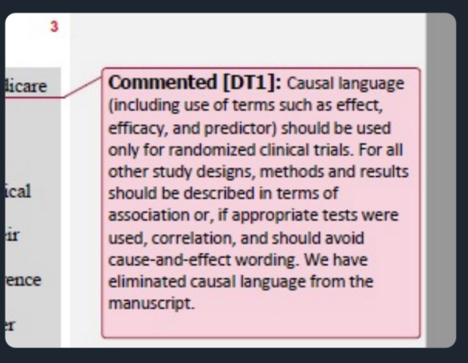
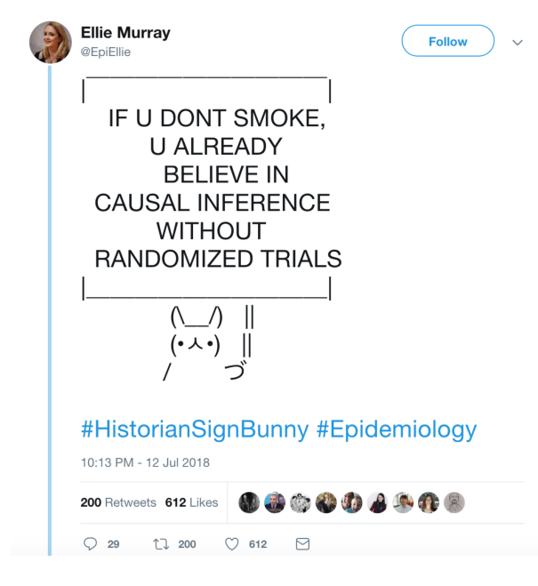
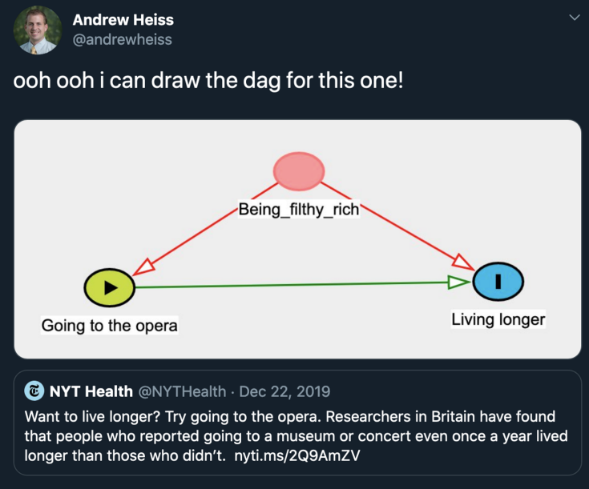
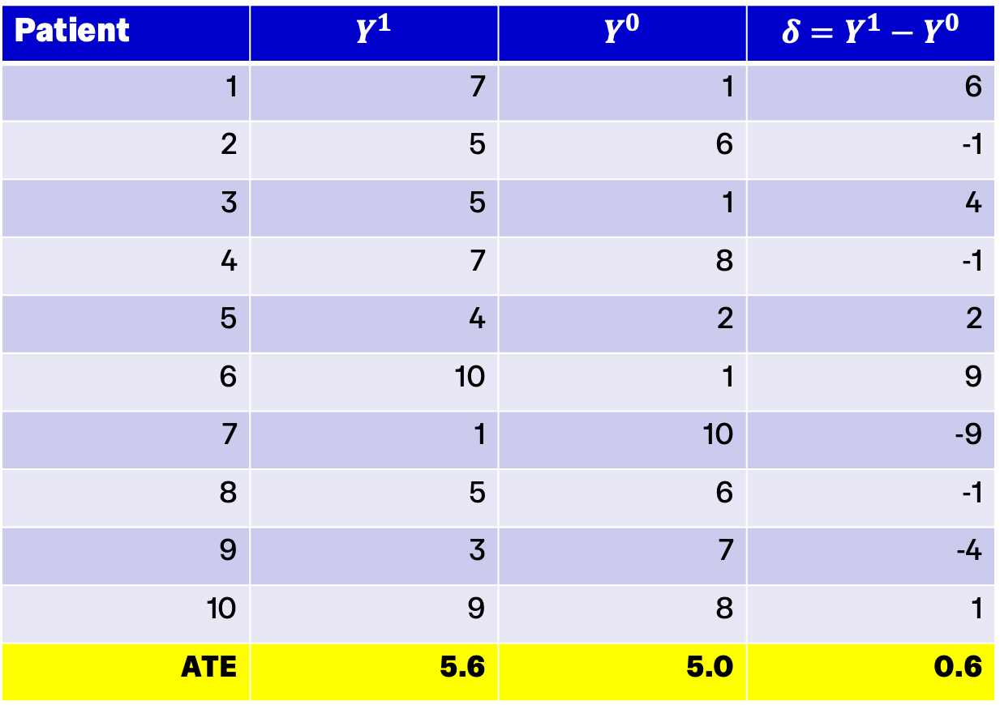
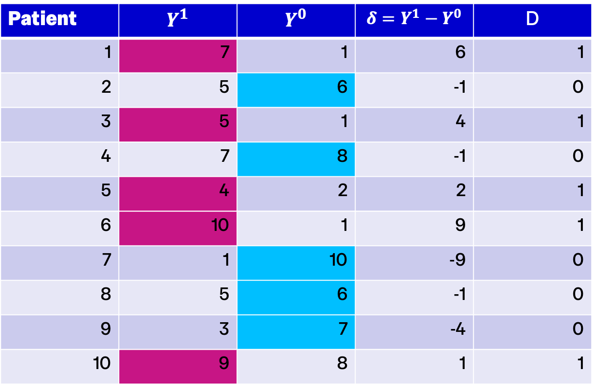
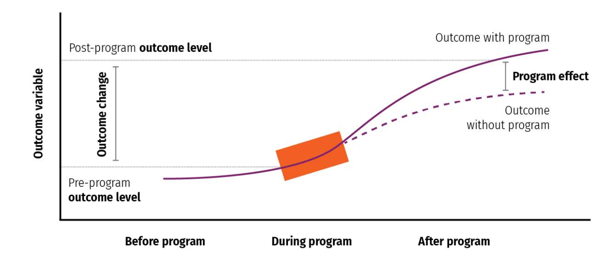

```{r setup, include=FALSE}
library(tidyverse)
library(dagitty)
library(ggdag)
library(ggthemes)

theme_metro <- function(x) {
  theme_classic() +
  theme(panel.background = element_rect(color = '#FAFAFA',fill='#FAFAFA'),
        plot.background = element_rect(color = '#FAFAFA',fill='#FAFAFA'),
        text = element_text(size = 16),
        axis.title.x = element_text(hjust = 1),
        axis.title.y = element_text(hjust = 1, angle = 0))
}
```

## Course road map

| Lecture | Topic |
| --- | --- |
| 1 | Introduction to health data & R |
| 2 | Data visualization |
| 3 | Data wrangling & exploratory data analysis |
| [**4**]{style="color: #C8102E"} | [**Causal inference**]{style="color: #C8102E"} |
| 5 | Linear regression |
| 6 | Linear regression: uncertainty & hypothesis testing |
| 7 | Panel data: difference-in-differences & fixed effects |
| 8 | Limited dependent variables: LPM, logit, probit |
| 9 | Introduction to machine learning for health analytics |
| 10 | Course review |

## The health analytics pipeline

::: {.centered-fig .nonincremental}
{width="80%"}
:::


## Today

- **Types of question:** measurement, prediction, causal
- **Association vs causality**
- **Randomised controlled trials (RCTs)**
- **Causal inference with observational data**
- **Two frameworks for reasoning about causality:**
  - Directed Acyclical Graphs (DAGs)
  - Potential outcomes
- **Selection bias and average treatment effects**

# Types of question

## What are we trying to do with data?

- Before choosing methods we must be clear about the goal of the analysis — not all health analytics is causal inference!
- **Description / Measurement:** Quantify patterns, levels, and differences in health outcomes
- **Prediction:** Accurately predict an outcome from inputs
- **Causal Inference:** Estimate the impact of one or more variables on an outcome
- These categories are about the question, not the method or data — the same statistical model (e.g. linear regression) could be used for all three types of question!

## Mental health in students

:::: {.columns}
::: {.column width="60%"}
- What proportion of university students report symptoms of anxiety or depression?
- Which students are most likely to experience anxiety?
- What is the effect of course load on mental health outcomes?
- Why are mental health outcomes worse among students from disadvantaged backgrounds?
- The last question is tricky — it is a bundle of causal questions about mechanisms
:::

::: {.column width="40%"}
{width="100%"}
:::
::::

## AI diagnostic tools

:::: {.columns}
::: {.column width="60%"}
- How accurately does an AI diagnostic tool predict whether a patient has acute myocardial infarction?
- How quickly have AI diagnostic tools been adopted by hospitals?
- What is the effect of rolling out AI diagnostic tools on patient outcomes?
- Prediction asks "How well can we predict Y from X?" Causal inference asks "What happens to Y if we change X?"
:::

::: {.column width="40%"}
{width="100%"}
:::
::::

## Association vs causality

- **Association:** A statistical relationship between variables — does not imply direction, counterfactuals or causation
- **Causality:** A relationship where one variable (cause) directly affects or brings about changes in another (effect)
- **Causal Inference:** Identification of causal relationships
- We want to build understanding of:
  - Causal pathways (X → Y)
  - Directionality (X → Y, not Y → X)
  - Mechanisms (X → A → Y)
- **Key question:** when can we say a relationship is causal?

# Randomized Controlled Trials

## RCTs and causality

- Experimental study design used to evaluate the causal effect of an intervention by randomly assigning participants into groups:
  - **Treatment Group(s):** Receives the intervention or treatment being tested
  - **Control Group:** Does not receive the intervention or receives a placebo or standard treatment
- **Key features:**
  - Randomization ensures characteristics are balanced across groups
  - Control group represents "counterfactual" (what would have happened in the absence of intervention)
- **Common features:**
  - "Blinding": participants or participants & researchers do not know which group they are in
  - Pre-specified outcomes

## RCTs establish causality because

- Randomization ensures treatment and control groups are statistically equivalent on observed and unobserved characteristics
- Effect of intervention is the ONLY difference between groups

## RCTs: gold standard or only standard?

:::: {.columns}
::: {.column width="60%"}
- Can we only believe randomized control trials? RCTs are extremely useful in some settings, but:
- **Not always feasible:**
  - Cost
  - Institutional constraints
  - Ethical concerns
  - Medium-long run effects
- **Generalizability:**
  - External validity
  - "Voltage drop" when scaled up
- Econometric analysis helps identify real world patterns from real world data
:::

::: {.column width="40%"}
{width="100%"}
:::
::::

## RCTs: gold standard or only standard? (continued)

::: {.centered-fig .nonincremental}

:::

## RCTs: gold standard or only standard? (evidence)

::: {.centered-fig .nonincremental}

:::

# Causal inference with observational data

## Observational data

- **Observational data:** retrospective, "real-world" data
  - Not (typically) collected in a controlled experimental setting
  - Surveys, claims, administrative records, etc.
- **Data Generating Process (DGP):** the underlying mechanisms, factors, and randomness that "generate" the observed data
- **Objective:** use the data to learn about the DGP!
- **Core challenge:**
  - Many different DGPs can generate similar observed patterns
  - Need to reason carefully about which are plausible

## Frameworks for reasoning about causality

- Why is causal inference with observational data hard?
  - Observational data do not reveal the true causal structure
  - Many causal explanations are consistent with the same observed patterns
  - Causal claims require assumptions — a framework helps us state these explicitly
- **What is a causal framework?** A conceptual way of reasoning about causality that defines:
  - What we mean by a causal effect
  - Which assumptions are required
  - How we reason from data to causal claims
- **Frameworks vs models:**
  - A framework is a broad conceptual approach
  - A model is a mathematical or statistical representation used to analyse data (e.g. linear regression model)

## Two widely used frameworks

- **Directed Acyclical Graphs (DAGs):**
  - Represent assumed causal relationships graphically
  - Clarify pathways, confounders, and sources of bias
- **Potential Outcomes Framework:**
  - Defines causal effects in terms of counterfactual outcomes: what would happen under alternative states of the world

# Directed Acyclic Graphs

## DAGs: Introduction

:::: {.columns}
::: {.column width="60%"}
- **Graphical representation** of causal relationships
- **Goal:** understand relation between:
  - Treatment (X)
  - Outcome (Y)
  - Covariate (Z)
- **Represented as** random variables (nodes) and influencing events (arrows)
- **Example:** Do surgery robots improve patient outcomes?
  - X: using a robot during surgery
  - Y: mortality rate, complication rate
  - Z: Surgeon experience, hospital quality
:::

::: {.column .fragment width="40%"}

```{r simple-dag, fig.width=6, fig.height=4, echo=FALSE}
dag_simple <- dagify(Y ~ X + Z, X ~ Z)
ggdag(dag_simple, layout = "sugiyama") + theme_dag()
```

:::
::::

## A more complex DAG

:::: {.columns}
::: {.column width="60%"}
- **Example: Robot-assisted surgery**
  - Y: Measured outcome (readmission)
  - X: Using a robot during surgery
  - Z: Doctor and patient demographics (observed)
  - R: Doctor skill (unobserved)
- **Types of relationships:**
  - Chain: A → B → C
  - Fork: C ← A → B
  - Inverted fork/collider: A → C ← B
:::

::: {.column .fragment width="40%"}

```{r complex-dag, fig.width=6, fig.height=5, echo=FALSE}
dag_complex <- dagify(Y ~ X + Z + R, X ~ Z + R, Z ~ R)
ggdag(dag_complex, layout = "sugiyama") + theme_dag()
```

:::
::::

## A more complex DAG (highlighting causal pathway)

:::: {.columns}
::: {.column width="60%"}
- A causal pathway is identified if the association between treatment and outcome is properly stripped and isolated
- DAG methods give insight into exactly what to do to isolate a pathway
:::

::: {.column .fragment width="40%"}

```{r complex-dag-2, fig.width=6, fig.height=5, echo=FALSE}
dag_complex2 <- dagify(Y ~ X + Z + R, X ~ Z + R, Z ~ R)
ggdag(dag_complex2, layout = "sugiyama") + theme_dag()
```

:::
::::

## Why do we need DAGs?

:::: {.columns}
::: {.column width="50%"}
{width="100%"}
:::

::: {.column width="50%"}
{width="100%"}
:::
::::


## Uses of DAGs

::: {.fragment}

```{r dag-concepts, fig.width=12, fig.height=4, echo=FALSE}
# Create three separate DAGs for confounding, mediation, and collider

# Confounding
dag_conf <- dagify(Y ~ X + Z, X ~ Z, labels = c(X = "X", Y = "Y", Z = "Z"))
p1 <- ggdag(dag_conf, layout = "sugiyama") + ggtitle("Confounding") + theme_dag()

# Mediation
dag_med <- dagify(Y ~ M + X, M ~ X, labels = c(X = "X", Y = "Y", M = "M"))
p2 <- ggdag(dag_med, layout = "sugiyama") + ggtitle("Causation with mediation") + theme_dag()

# Collider
dag_coll <- dagify(C ~ X + Y, labels = c(X = "X", Y = "Y", C = "C"))
p3 <- ggdag(dag_coll, layout = "sugiyama") + ggtitle("Collision") + theme_dag()

gridExtra::grid.arrange(p1, p2, p3, ncol = 3)
```

:::

- **Confounding:** a variable that causes both the exposure and the outcome
  - Conditioning on it is usually necessary
  - Example: Age confounds the relationship between exercise and health
- **Collider:** a variable that is caused by two or more variables
  - Conditioning on it induces spurious associations
  - Example: Hospital admission caused by both disease severity and access

## Collider bias example: Admission rate bias (Berkson's bias)

:::: {.columns}
::: {.column width="60%"}
- Distortion in assessment of the relation between an exposure and a disease that arises because the subjects studied had been admitted to hospital
- **Example:** estimating the effect of BMI on diabetes among patients attending hospital
- If we condition on hospital admission, we may find a spurious negative relationship between BMI and diabetes because people with low BMI must have other serious conditions to be admitted
:::

::: {.column .fragment width="40%"}

```{r berkson-dag, fig.width=6, fig.height=4, echo=FALSE}
dag_berkson <- dagify(A ~ X + Y, labels = c(X = "BMI", Y = "Diabetes", A = "Hospital Admission"))
ggdag(dag_berkson, layout = "sugiyama") + theme_dag()
```

:::
::::

## DAG takeaways

- **DAGs are good for:**
  - Making causal assumptions explicit
  - Clarifying causal pathways and sources of bias
  - Deciding which variables should — and should not — be conditioned on
  - Diagnosing confounding, collider bias, and mediation
- **DAGs do not:**
  - Prove that assumptions are correct
  - Capture every dynamic or feedback process
- DAGs help us think about causal structure, but they don't tell us exactly which causal effect we are trying to measure
- For help drawing DAGs in R: [evalf22.classes.andrewheiss.com/example/dags.html](https://evalf22.classes.andrewheiss.com/example/dags.html)


# Potential Outcomes Framework

## Core idea

- To talk about causal effects, we need to compare outcomes under different scenarios
- For any individual, we can imagine:
  - What would happen if they were treated
  - What would happen if they were not treated
- The causal effect is the difference between these two outcomes
- **Fundamental problem:** We never observe both outcomes for the same individual!

## The fundamental problem of causal inference

- One of the potential outcomes is always missing — this missing counterfactual is what makes causal inference challenging
- We observe only one of the two potential outcomes for each individual
- The missing counterfactual must be estimated or assumed

## Potential outcomes notation

- $Y_{0i}$ i's outcome if she doesn't receive treatment
- $Y_{1i}$ i's outcome if she receives treatment
- **Causal effect for individual i** $Y_{1i}-Y_{0i}$
- The challenge:
  - We can observe either $Y_{1i}$ (if treated) or $Y_{0i}$ (if not treated)
  - But never both for the same person
  - Must reason about the missing counterfactual

## Individual heterogeneity

- **Amir (a)** has a broken leg:
  - $Y_{0a}$ if he doesn't get surgery, his leg doesn't heal properly
  - $Y_{1a}$ if he gets surgery his leg heals completely
  - **Causal effect for Amir** is $Y_{1a}-Y_{0a}$. Enormous benefit!
- **Bari (b)** doesn't have any broken bones — her health is fine:
  - $Y_{0b}$ if she doesn't go to the hospital, her health is still fine
  - $Y_{1b}$ if she goes to the hospital, she gets a hospital-acquired infection
  - **Causal effect for Bari** is $Y_{1b}-Y_{0b}$. Treatment is harmful! 

## Difference in group means

- For any individual we can only observe one potential outcome:

::: {.fragment}
$$
Y_i = \begin{cases} Y_i^0 & \text{if } D_i = 0 \\ Y_i^1 & \text{if } D_i = 1 \end{cases}
$$
:::

- $D_i$ is a treatment indicator. When we compare (many) treated people to (many) non-treated people:

::: {.fragment}
$$
\text{Difference in group means} = \mathbb{E}[Y_i \mid D_i = 1] - \mathbb{E}[Y_i \mid D_i = 0] = \mathbb{E}[Y_i^1 \mid D_i = 1] - \mathbb{E}[Y_i^0 \mid D_i = 0]
$$
:::

- Add and subtract $\mathbb{E}[Y_i^0 \mid D_i = 1]$ (which equals zero):

::: {.fragment}
$$
\text{Diff in means} = \underbrace{\mathbb{E}[Y_i^1 \mid D_i = {\color{red}1}] - \mathbb{E}[Y_i^0 \mid D_i = {\color{red}1}]}_{\text{Average causal effect on treated (ATT)}} + \underbrace{\mathbb{E}[Y_i^0 \mid D_i = {\color{red}1}] - \mathbb{E}[Y_i^0 \mid D_i = {\color{red}0}]}_{\text{Selection bias}}
$$
:::

- The challenge: the difference in group means includes both the true effect AND selection bias

## Selection bias

::: {.fragment}
$$
\text{Diff in means} = \underbrace{\mathbb{E}[Y_i^1 \mid D_i = {\color{red}1}] - \mathbb{E}[Y_i^0 \mid D_i = {\color{red}1}]}_{\text{Average causal effect on treated (ATT)}} + \underbrace{\mathbb{E}[Y_i^0 \mid D_i = {\color{red}1}] - \mathbb{E}[Y_i^0 \mid D_i = {\color{red}0}]}_{\text{Selection bias}}
$$
:::

- **Selection bias** occurs when treated and untreated groups differ in what their outcomes would be absent treatment
- **Example:** Patients with less severe conditions are more likely to get surgery, so treated patients would have better outcomes anyway, even without surgery

## RCTs and selection bias

- When treatment is assigned at random, it is independent of potential outcomes 
  $$\mathbb{E}[Y_i^1 \mid D_i = 1] =  \mathbb{E}[Y_i^1 \mid D_i = 0]$$
- In the absence of treatment, treated and untreated groups have the same expected outcomes
- The difference in means identifies a causal effect
- This is why RCTs are so powerful!

## Average Treatment Effects

- **ATE (Average Treatment Effect):** the expected causal effect across the entire population
- **ATT (Average Treatment Effect on the Treated):** the effect for those who were treated
- **Interpreting a difference in means as an ATE or ATT requires assumptions:**
  - No selection on unobservables
  - Overlap (common support): both groups have similar characteristics
  - Stable unit treatment value assumption (SUTVA)

## Example: How effective is a medical treatment?

:::: {.columns}
::: {.column width="60%"}
- Suppose we have an oracle that gives us both states of the world for all individuals
- Then we could calculate the true average treatment effect:
  - We see ALL potential outcomes for everyone
  - Calculate $Y_{1i} - Y_{0i}$ for each person
  - Take the average to get ATE of $5.6-5=0.6$
:::

::: {.column width="40%"}
{width="100%"}
:::
::::

## Example: The "perfect doctor"

:::: {.columns}
::: {.column width="60%"}
- Imagine a "perfect doctor" assigns the best treatment available to each patient:
  - Patients with high expected gains get treated
  - Patients with low expected gains don't get treated
- The naive difference in means is misleading because treatment is assigned based on expected gains
- $\bar{Y_{1}} - \bar{Y_{0}} = 7-7.4=-0.4$
- This illustrates the challenge of non-random treatment assignment in observational data
:::

::: {.column width="40%"}
{width="100%"}
:::
::::

## Potential Outcomes over time

::: {.centered-fig .nonincremental}
{width="100%"}
:::

## What is a model?

- A model is a mathematical or statistical representation of relationships in the data (e.g. a linear regression model)
- **By itself, a model is NOT causal**
- **A model has a causal interpretation ONLY under assumptions** called identifying assumptions
- These assumptions come from:
  - A causal framework (e.g. DAGs or potential outcomes)
  - Subject-matter knowledge about the real world
- **Key insight:** Identifying assumptions are what let us interpret a statistical model causally — without them, the model is just descriptive or predictive

## Lecture takeaways

- **Not all health analytics is causal:** distinguish descriptive, predictive, and causal questions
- **Every causal claim rests on assumptions:** data alone cannot tell us what causes what
- **RCTs solve selection bias by design**
- **Two complementary frameworks** for reasoning about causality:
  - **DAGs** make confounders, mediators and colliders visible
  - **Potential outcomes** formalise counterfactuals 
- **The fundamental problem of causal inference:** we never observe both potential outcomes for the same individual
- **Models are not causal by themselves:** a statistical model has a causal interpretation only under identifying assumptions
- **Coming next:** linear regression
