```{r setup, include=FALSE}
library(tidyverse)
library(gganimate)
library(tidymodels)
library(estimatr)
library(magick)
library(dagitty)
library(ggthemes)
library(countdown)
library(marginaleffects)
library(directlabels)
library(ggdag)
library(ggpubr)
library(fixest)
library(modelsummary)
library(jtools)
library(survival)
library(survminer)
library(scales)
library(cowplot)
library(gapminder)
theme_metro <- function(x) {
  theme_classic() + 
  theme(panel.background = element_rect(color = '#FAFAFA',fill='#FAFAFA'),
        plot.background = element_rect(color = '#FAFAFA',fill='#FAFAFA'),
        text = element_text(size = 16),
        axis.title.x = element_text(hjust = 1),
        axis.title.y = element_text(hjust = 1, angle = 0))
}
theme_void_metro <- function(x) {
  theme_void() + 
  theme(panel.background = element_rect(color = '#FAFAFA',fill='#FAFAFA'),
        plot.background = element_rect(color = '#FAFAFA',fill='#FAFAFA'),
        text = element_text(size = 16))
}
theme_metro_regtitle <- function(x) {
  theme_classic() + 
  theme(panel.background = element_rect(color = '#FAFAFA',fill='#FAFAFA'),
        plot.background = element_rect(color = '#FAFAFA',fill='#FAFAFA'),
        text = element_text(size = 16))
}
```
 
## Course road map

| Lecture | Topic |
| --- | --- |
| 1 | Introduction to health data & R |
| 2 | Data visualization |
| 3 | Data wrangling & exploratory data analysis |
| 4 | Causal inference |
| 5 | Linear regression |
| 6 | Linear regression: uncertainty & hypothesis testing |
| 7 | Panel data: difference-in-differences & fixed effects |
| 8 | Limited dependent variables: LPM, logit, probit |
| [**9**]{style="color: #C8102E"} | [**Introduction to machine learning for health analytics**]{style="color: #C8102E"} |
| 10 | Course review |


## Today

- What is machine learning
- The problem of overfitting
- Typology of machine learning techniques
- Predicting breast cancer diagnosis with Lasso and Random Forests

## What is machine learning?

:::: columns
::: {.column}

{fig-align="center" fig-alt="Machine learning diagram" width=80%} 

:::

::: {.column}

* **AI** is the broad field of creating computer systems that perform tasks normally requiring human intelligence. These tasks include:

  * perception (e.g., recognizing images or speech)
  * reasoning and problem solving
  * understanding language
  * decision-making
  
* **Machine learning** is a subset of AI that focuses on systems that learn patterns from data 

  * **training**: learn from existing data
  * **prediction**: use what was learned to make decisions on new data

:::
::::


## Uses of AI in health analytics

AI is used across the healthcare system to:

- **Predict outcomes:**  e.g. complications, readmissions, mortality

- **Support diagnosis**  e.g. image interpretation, risk scoring

- **Personalise treatment** matching patients to therapies

- **Improve operations**: scheduling, staffing, capacity planning

## Examples of AI tools used in healthcare

| Tool              | Used for                                                                 | Used by               |
|-------------------|--------------------------------------------------------------------------|-----------------------|
| Aidoc             | Facilitating early disease detection and minimizing diagnostic errors     | Hospitals             |
| Shift Technology  | Streamlining claims processing and fraud detection                        | Insurance companies   |
| Atomwise          | Identifying potential drug candidates and predicting their efficacy       | Drug development      |
| BenevolentAI      | Decreasing the time and expense associated with bringing new treatments to market | Drug development |
| Digital Diagnostics | Detecting conditions such as diabetic retinopathy and skin cancer from medical images | Diagnostics |
| PathAI            | Achieving results comparable to those of experienced clinicians in diagnostics | Diagnostics        |
| Qventus           | Enhancing operational efficiency using AI-powered predictive analytics    | Healthcare facilities |
| LeanTaaS          | Optimizing resource allocation and reducing operational costs             | Healthcare facilities |

*Source: DataCamp, “AI in Healthcare”*  
<https://www.datacamp.com/blog/ai-in-healthcare>

## What is the goal of machine learning?

- Machine learning is not defined by the **type** of model used but by the **goal**
- Use data to learn a rule that predicts an outcome for new observations!
<!-- -->
- At its core, machine learning is about learning a function
- Given data $(X, Y)$, we want to learn a rule $f(X)$ that maps inputs $X$ to outcomes $Y$.
- The goal is to choose $f(X)$ so that predictions are accurate for *new, unseen* data
- Many different functions can fit the observed data!
- Machine learning is about choosing between them!

## Training and testing data

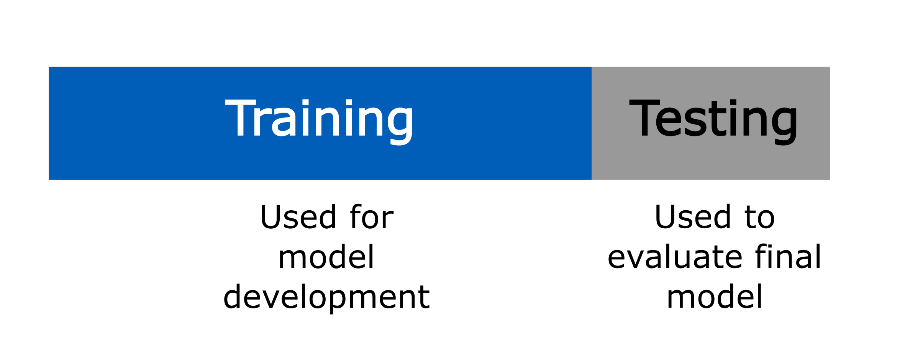{fig-align="center" fig-alt="Training and testing diagram" width=70%} 

## The problem of overfitting

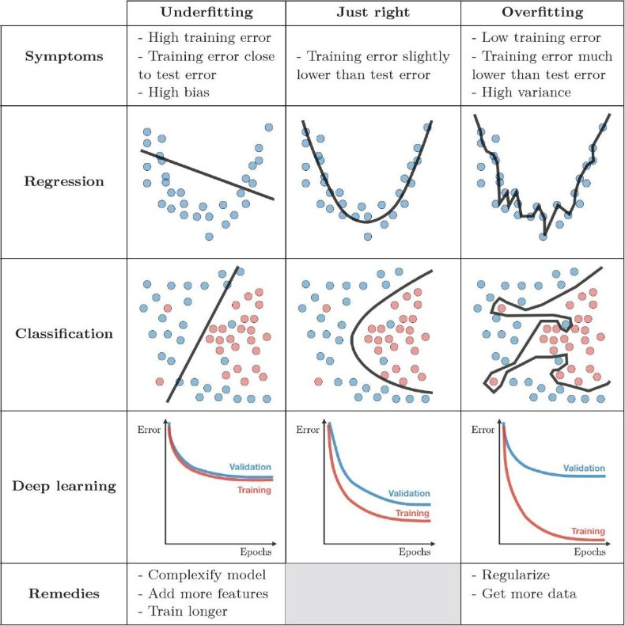{fig-align="center" fig-alt="Machine learning diagram" width=45%} 

## Machine learning methods

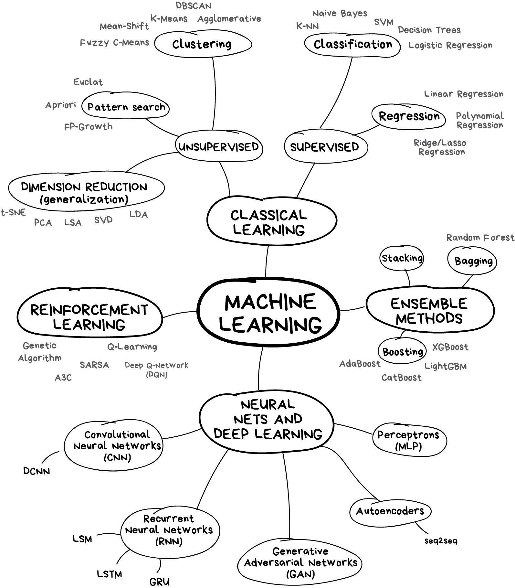{fig-align="center" fig-alt="Machine learning typology" width=45%} 


## A basic typology of machine learning methods

- Different ML methods are different ways of restricting and choosing the function $\widehat{f}(X)$
- **Regression + regularisation:** e.g. LASSO, ridge 
  - Start with a standard regression model with many variables (linear, logit)
  - *Regularisation* shrinks or constrains coefficients in the model to prevent overfitting  
- **Tree-based methods:** e.g. random forests
  - Build the relationship using a sequence of data-driven splits in $X$
  - Capture nonlinearities and interactions without specifying them in advance
  - Average across trees and constrain depth of trees to prevent overfitting
- **Neural networks:** e.g. convolutional NNs, large language models
  - Construct the relationship through "layers" of nonlinear transformations
  - Overfitting controlled by constraining the complexity of the function
  - especially useful with high-dimensional or unstructured inputs (free text, images, audio)

## A note on terminology

- **Feature**: a component of $X$ (or a transformation or function of it) used to predict $Y$
- **Loss**: how we measure prediction error (e.g. squared error, log loss)
- **Model**: the class of functions considered
- **Algorithm**: the procedure used to fit the model


## Machine learning in R: {tidymodels}

:::: columns

::: {.column}

* A collection of R packages for statistical modelling and machine learning.

* Follows the {tidyverse} principles.

* `install.packages("tidymodels")`

:::

::: {.column .center}

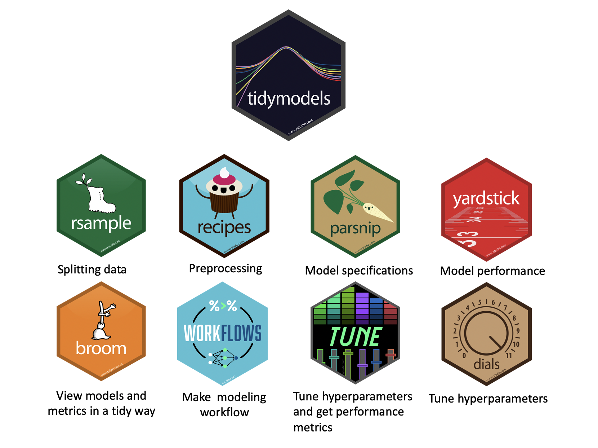{fig-align="center" fig-alt="tidymodels packages hex sticker logo" width=100%} 

<small>Source: <a href="https://rpubs.com/chenx/tidymodels_tutorial">rpubs.com/chenx/tidymodels_tutorial</a></small>

:::

::::


## Recipe and workflow

:::: columns

::: {.column width="30%"}

{fig-align="center" fig-alt="recipes package hex sticker" width=80%} 

:::

::: {.column width="70%"}

- **Recipe**: A series of preprocessing steps applied to the data *before* fitting a model, such as:
  - Creating dummy variables for categorical predictors  
  - Normalizing or transforming numeric variables  
  - Handling missing values  
  - Creating interactions or derived features  

- **Workflow**: An object that bundles all steps of the modelling process, including:
  - Pre-processing (the `recipe`)  
  - The model specification  
  - Post-processing (e.g. predictions, performance metrics)

- Workflows ensure the same steps are applied consistently during training, validation, and prediction.


:::

::::

## Exercise: Exploratory data analysis and standard logit

- Open `health_analytics_09_ml.Rmd` for prompts.

- **Load the data**
  Read in the `bdiag.csv` data

- **Explore the data**  
  Inspect variables, plot correlations between different variables
  
- **Estimate a vanilla logit**  
  Look at what goes wrong!

::: {.fragment}
```{r}
#| echo: false
#| label: ex-1-timer
countdown::countdown(minutes = 10,
                    color_border = "#005EB8",
                    color_text = "#005EB8",
                    color_running_text = "white",
                    color_running_background = "#005EB8",
                    color_finished_text = "#005EB8",
                    color_finished_background = "white",
                    top = 0,
                    margin = "1.2em",
                    font_size = "2em")
```
:::

# LASSO regression {background-color="#D9DBDB"}

## Linear and logistic regression models

:::: columns

::: {.column .fragment}
**Linear regression**

```{r}
#| label: lin-reg
#| eval: false
#| echo: true
lm(y ~ x, data = model_data)
```

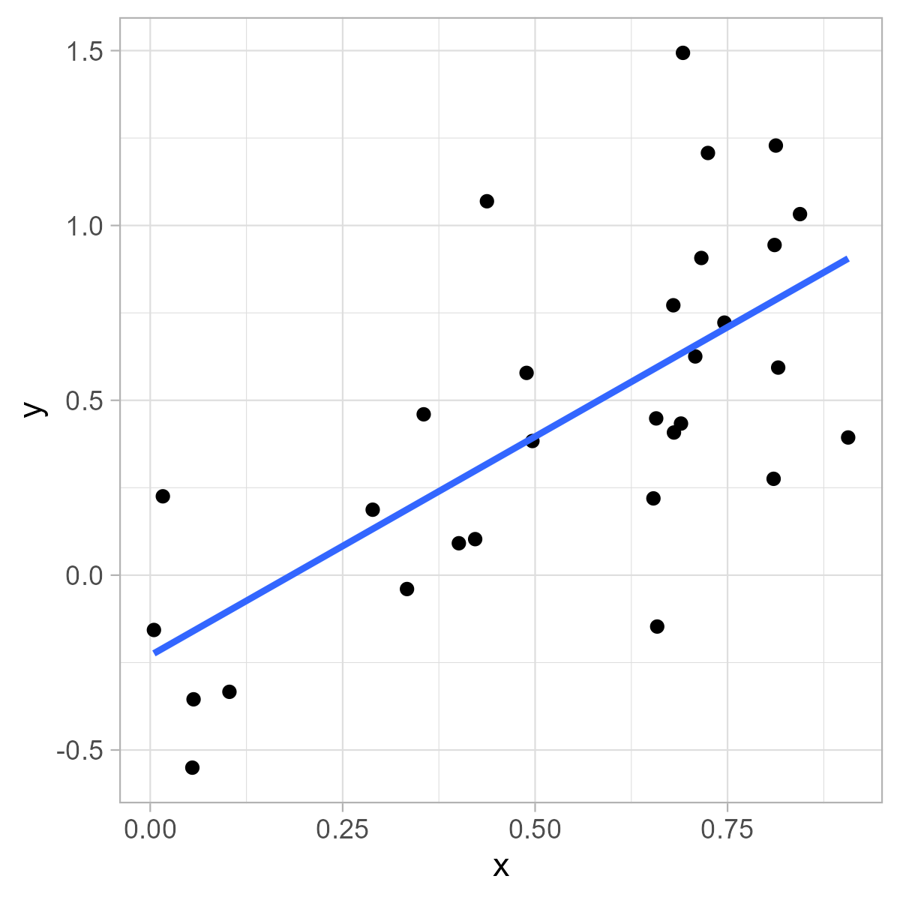{fig-align="center" fig-alt="Linear regression plot" width=70%}

:::

::: {.column .fragment}
**Logistic regression**

```{r}
#| label: log-reg
#| eval: false
#| echo: true
glm(y ~ x, family = "binomial", data = model_data)
```

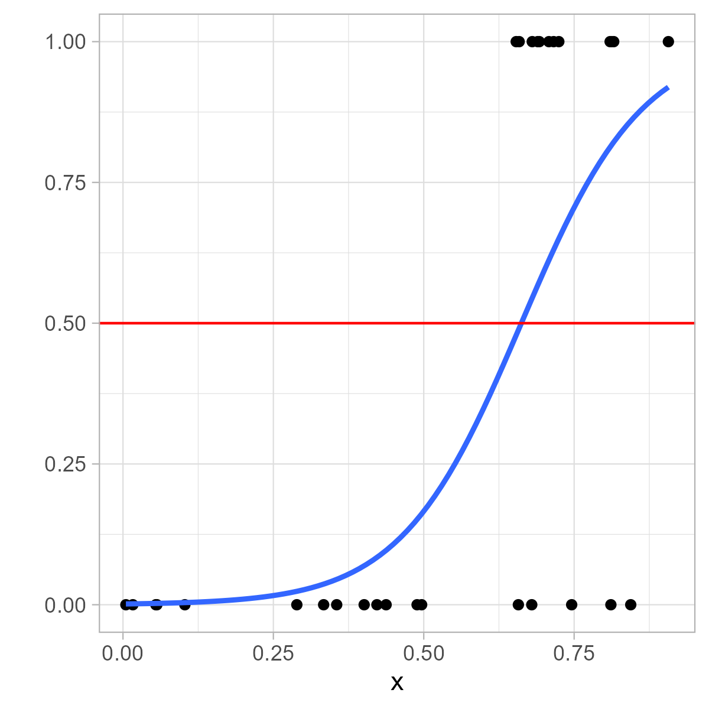{fig-align="center" fig-alt="Linear regression plot" width=70%}

:::

::::

# LASSO regression
## LASSO regression
:::: columns
::: {.column}

- **Standard regression**: chooses $\beta$ coefficients to minimize prediction error

- **Least Absolute Shrinkage and Selection Operator (LASSO)**: adds a penalty for using large or many coefficients:
$$
\min_{\beta} \; \text{Loss}(\beta) \;+\; \lambda \sum_j |\beta_j|
$$
- Loss function depends on model choice:
  - **Linear regression:** sum of squared residuals (SSR)  
  - **Logistic regression:** negative log-likelihood  

- **Key difference**
  - Regression focuses only on fit  
  - LASSO trades off fit against model simplicity  
  - Larger $\lambda$ pushes more coefficients towards zero
  - $\lambda$ is a **hyperparameter**

:::
::: {.column .fragment}

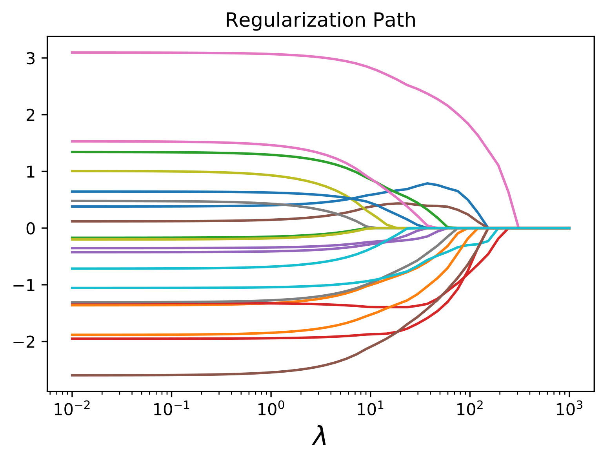{fig-align="center" fig-alt="Lambda plot for lasso regression" width=100%}

<small>Source: <a href="https://www.cvxpy.org/examples/machine_learning/lasso_regression.html">cvxpy.org/examples/machine_learning/lasso_regression.html</a></small>

:::
::::

## Hyperparameters

:::: columns

::: {.column width="40%"}

- Some parts of a model are **not learned directly from the data**.

- **Model parameters** (e.g. coefficients $\beta$)  
  → estimated during training

- **Hyperparameters** (e.g. $\lambda$ in LASSO)  
  → chosen by the researcher
  → usually try out a variety of values and test their performance using `cross-validation' on different splits of the training data
  → control how the model learns

- Hyperparameters affect model complexity and overfitting!

:::

::: {.column .fragment width="60%"}

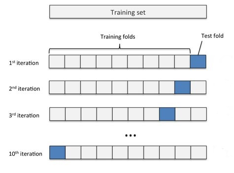{fig-align="center" fig-alt="kfold validation" width=60%} 

<small>Source: <a href="https://www.researchgate.net/publication/332370436_Introduction_to_Support_Vector_Machines_and_Kernel_Methods">Introduction to Support Vector Machines and Kernel Methods. Ashfaque and Iqbal. 2019.</a></small>

:::

::::

# Evaluating model fit
## Evaluating model fit

- In the exercise, we’ll fit **many** logistic LASSO models (different values of $\lambda$).  
- To choose the “best” one, we need a way to judge **predictive performance**.
- Two common approaches:
  - **Confusion matrix** 
  - **ROC AUC**


## Confusion matrix 

|                | Predicted 1 | Predicted 0 |
|----------------|-------------|-------------|
| **Actual 1**   | True Positive (TP) |  False Negative (FN)         |
| **Actual 0**   | False Positive (FP)         | True Negative (TN)          |

- A classification model outputs **predicted probabilities**.
- To create a confusion matrix, we choose a cutoff (threshold):
  - Predict **1** if predicted probability $\geq$ threshold  
  - Predict **0** otherwise
- A confusion matrix summarizes predictions at a **single threshold** (e.g. 0.5).
- **Accuracy** $= \frac{TP + TN}{TP+TN+FP+FN}$

## The limitation of confusion matrices

- A confusion matrix depends on **choosing a threshold** to turn probabilities into classes.
  - Example: If $\hat{p}_i > 0.5$, predict “1”; otherwise “0”.
- But different thresholds give different confusion matrices, and therefore different accuracy
- *How do we evaluate a model without committing to one arbitrary threshold?*

## ROC curve: performance across thresholds

:::: columns
::: {.column}


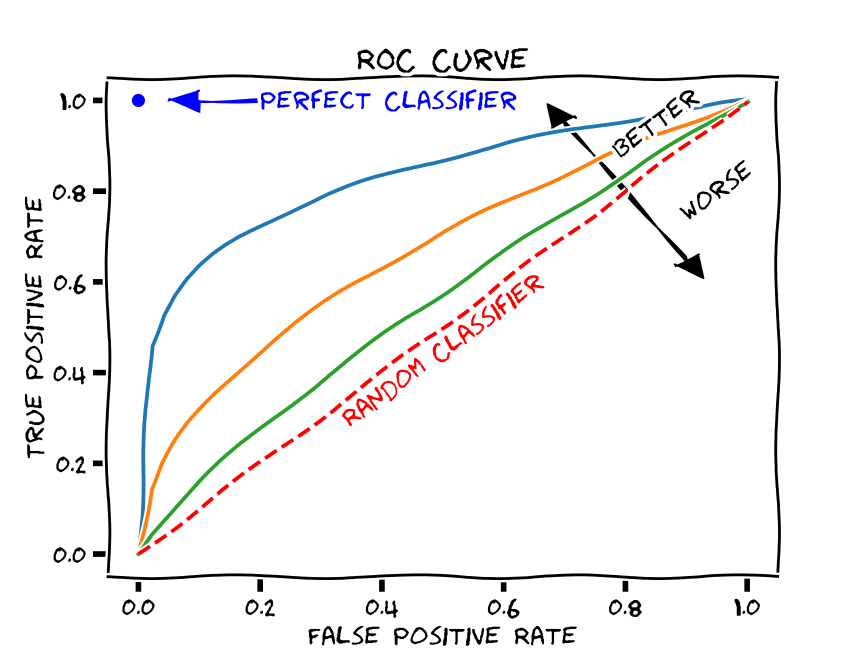{fig-align="center" fig-alt="ROC curve" width=100%}

<small>Source: <a href="https://commons.wikimedia.org/wiki/File:Roc-draft-xkcd-style.svg#filelinks">Martin Thoma (Wikipedia)</a></small>

:::
::: {.column .fragment .center}
- The ROC curve varies the threshold from 0 to 1 and plots:
  - **True Positive Rate (TPR / sensitivity)**  
  $$
  TPR = \frac{TP}{TP+FN}
  $$
  - **False Positive Rate (FPR)**  
  $$
  FPR = \frac{FP}{FP+TN}
  $$
- Each threshold $\Rightarrow$ one confusion matrix $\Rightarrow$ one point on the ROC curve.
- **ROC AUC** = *area under the ROC curve*
- Interpretable as: probability a randomly chosen positive case gets a higher score than a randomly chosen negative case
- See [yardstick.tidymodels.org/articles/metric-types.html](https://yardstick.tidymodels.org/articles/metric-types.html).

:::
::::

## Exercise: Estimating a LASSO logistic regression in R

- Split data into training and test datasets 
- Define training data subsets for cross-validation  
  - Split training data into **folds** for cross-validation
  - Repeated cross-validation trains and validates the model many times on different subsets of the training data 

- Specify the model using `logistic_reg()`.
- Tune the hyperparameter.
- Choose the best value and fit the final model.
- Evaluate the model performance.

::: {.fragment}
```{r}
#| echo: false
#| label: ex-2-timer
countdown::countdown(minutes = 10,
                    color_border = "#005EB8",
                    color_text = "#005EB8",
                    color_running_text = "white",
                    color_running_background = "#005EB8",
                    color_finished_text = "#005EB8",
                    color_finished_background = "white",
                    top = 0,
                    margin = "1.2em",
                    font_size = "2em")
```
:::

# Random Forests 
## Decision trees

:::: columns
::: {.column}

- A tree-like model of decisions and their possible consequences

:::
::: {.column}

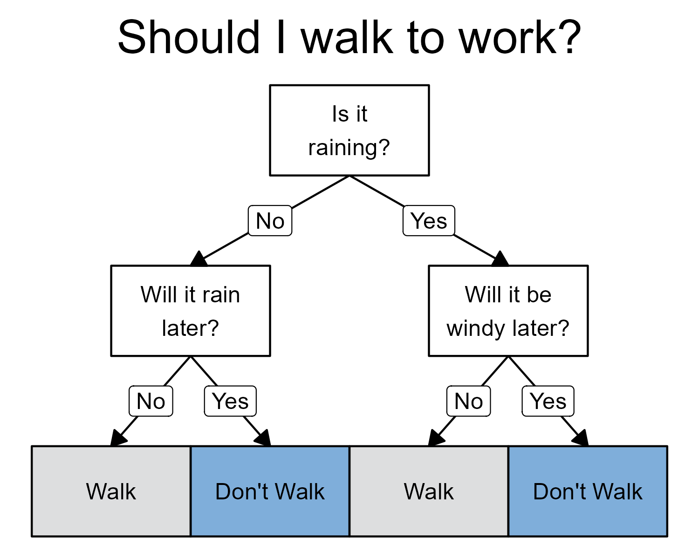{fig-align="center" fig-alt="Decision tree about walking to work and the weather" width=90%}

:::
::::

## What are Random Forests?

:::: columns
::: {.column}

* An ensemble method

* Combines many decision trees.

* Can be used for classification or regression problems.

* For classification tasks, the output of the random forest is the class selected by most trees.

:::
::: {.column}

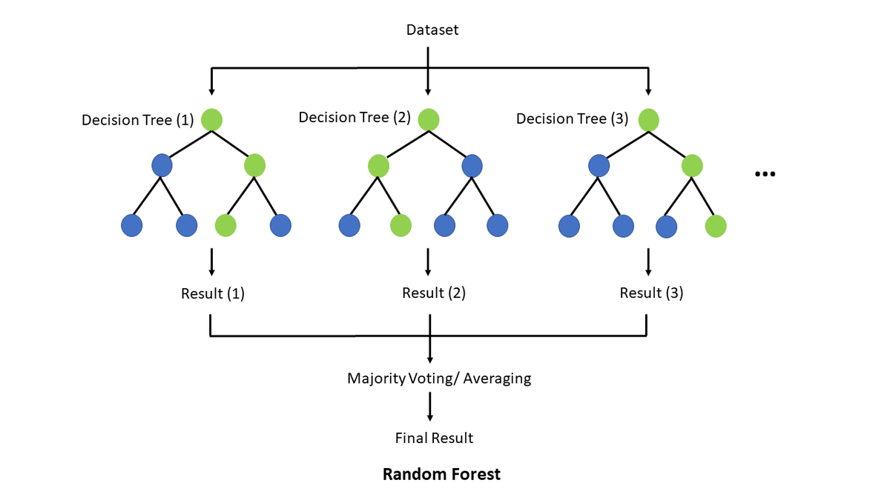{fig-align="center" fig-alt="Random Forest diagram" width=100%}

<small>Source: <a href="https://en.m.wikipedia.org/wiki/File:Random_forest_explain.png">Tse Ki Chun (Wikimedia)</a></small>

:::
::::

## Hyperparameters for random forests

- **trees**: number of trees in the ensemble.

- **mtry**: number of predictors that will be randomly sampled at each split when creating the tree models.

- **min_n**: minimum number of data points in a node that are required for the node to be split further.

## Exercise: Random Forests in {tidymodels}

- Specify a random forest model using `rand_forest()`

- Tune the hyperparameters using the cross-validation folds.

- Fit the final model and evaluate it.

::: {.fragment}
```{r}
#| echo: false
#| label: ex-3-timer
countdown::countdown(minutes = 10,
                    color_border = "#005EB8",
                    color_text = "#005EB8",
                    color_running_text = "white",
                    color_running_background = "#005EB8",
                    color_finished_text = "#005EB8",
                    color_finished_background = "white",
                    top = 0,
                    margin = "1.2em",
                    font_size = "2em")
```
:::


## Takeaways

- **AI vs ML:** AI is the broad field of building systems that perform tasks normally requiring human intelligence; **ML** is the subset that learns patterns from data
- **The goal of ML is usually prediction:** find a rule $\hat{f}(X)$ that generalises to *new, unseen* data, not one that fits the training data perfectly
- **Overfitting** is the central problem of ML: a model that fits noise in the training data will perform poorly out of sample
- Methods differ in **how they restrict $\hat{f}(X)$** to fight overfitting:
    - **Regularised regression** (LASSO, ridge) shrinks coefficients
    - **Tree-based methods** (random forests) average shallow trees and capture nonlinearities/interactions automatically
    - **Neural networks** use layers of nonlinear transformations and constrain complexity
- **How we estimate, tune, and evaluate fairly:**
  - **Training data** → fit model parameters
  - **Validation data / cross-validation** → tune **hyperparameters** (e.g. the LASSO penalty $\lambda$, tree depth)
  - **Test data** → evaluate final performance on held-out observations


